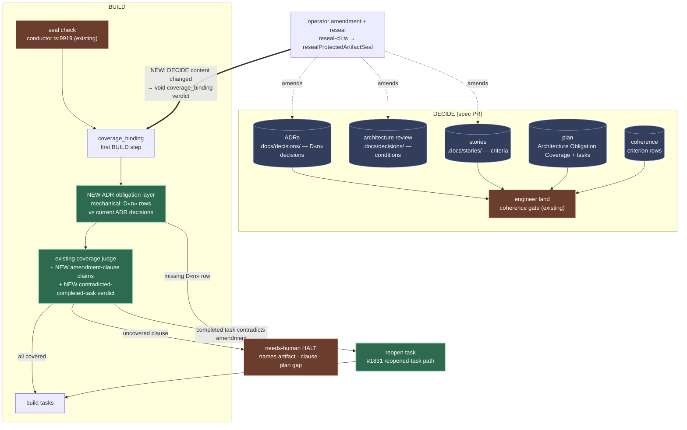
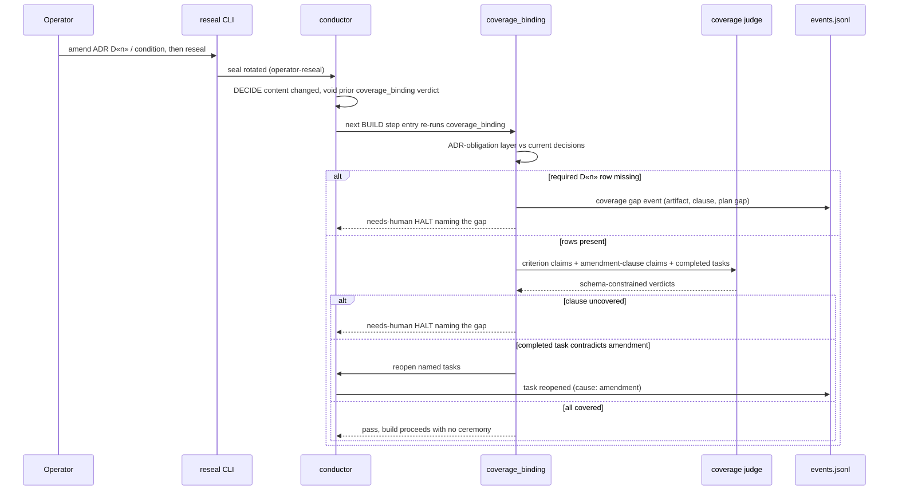

# Architecture: post-plan DECIDE amendments reconcile at BUILD entry

**Last updated:** 2026-09-23
**Scope:** How `coverage_binding` (the first BUILD step) re-derives DECIDE obligations from the
current sealed artifacts — including amendments made after plan approval — and how an operator
reseal re-arms that check and reopens completed work the amendment contradicts.
**Tier:** M — technical track. Source: intake #1700.

## Problem in one line

The plan's `## Architecture Obligation Coverage` table and coherence criterion rows are validated
only at `engineer land` (`engineer/coherence-validator.ts:1585` → `validateArchitectureObligationCoverage`).
A DECIDE amendment made after land (new ADR `D<n>`, an amended architecture-review condition, a
replaced story criterion) is never compared with the plan again, so the gap surfaces laps later in
`build_review`/`remediate` as a refused `plan` routing and a needs-human HALT (recurred 2026-09-10).

## Diagram 1 — where the obligation refresh sits

## Diagram 2 — amend-after-plan sequence

## Legend

- **Green** — new behavior this feature adds. **Brown** — existing gates. **Blue** — sealed
  DECIDE artifacts (`protected-artifact-seal.ts:18-24`; coherence is not sealed).
- **Mechanical** checks (missing `D«n»` row) never call the judge; story criteria stay validated at land only; only
  coverage of free-prose amendment clauses and task contradiction are judgement calls, per the
  repository's machinery-plus-judgement principle.
- Every outcome is emitted on the existing event spine; no sidecar channel.

## Change Log

| Date | Change | Reason |
|------|--------|--------|
| 2026-09-23 | Initial generation | Intake #1700 DECIDE |
| 2026-09-23 | Drop BUILD-time criterion layer; reopen only after a reseal void | Conflict-check resolutions |
| 2026-09-23 | Plan update: void lives in `coverage-binding-void.ts`, reopen through shared `repair-restage.ts`; no structural change to the diagrams | /plan |
