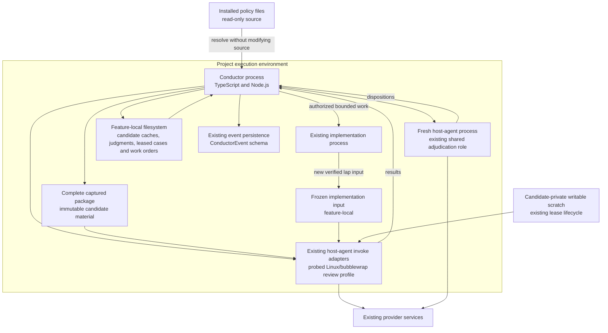

# Containers: Portable build review policy

**Last updated:** 2026-09-10
**Plan update approved:** James Stoup, 2026-09-11
**Scope:** Proposed L2 view for #1986; runtime isolation and durable storage, diagram approved by operator 2026-09-10.

> **Amended 2026-09-10 by #1986:** The approved runtime mechanism is the review-specific Linux/bubblewrap profile, composed with existing provider/self-host protection and private scratch leases (Tasks 12–15). Existing case/effect stores remain the sole recovery owners (Tasks 35–39). No new runtime service is planned.

## Diagram

## Legend

Process boxes are existing runtime roles, not new services. The diagram proposes read-only review access while retaining writable engine evidence and separately authorized implementation writes. No new network listener, shared database, background watcher, or policy-installation service is introduced. The full architecture review selects the exact policy materialization and host containment mechanisms.

## Change Log

| Date | Change | Reason |
|------|--------|--------|
| 2026-09-10 | Initial runtime boundaries | Make isolation and durable-state ownership explicit |
| 2026-09-10 | Plan-update: concrete candidate, authority, and recovery boundaries | Reflect the approved architecture and 40-task implementation plan |
