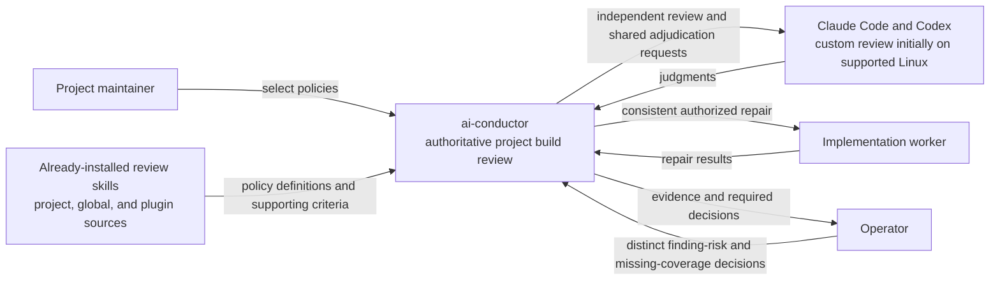

# System Context: Portable build review policy

**Last updated:** 2026-09-10
**Plan update approved:** James Stoup, 2026-09-11
**Scope:** Proposed L1 view for #1986; approved product scope, diagram approved by operator 2026-09-10.

> **Amended 2026-09-10 by #1986:** The plan supports both host adapters and all three installed source types. Custom execution initially requires the approved Linux containment boundary. Operator risk and missing-coverage decisions are separate authorities; no installation service is added.

## Diagram

## Legend

ai-conductor is one system at this level. Hosts and already-installed policies are external inputs. Installation and marketplace publication are not part of this feature. Existing tracker effects used by adjudication remain existing integrations; the feature adds no external service.

## Change Log

| Date | Change | Reason |
|------|--------|--------|
| 2026-09-10 | Initial context | Show consumer and provider boundaries |
| 2026-09-10 | Plan-update: concrete candidate, authority, and recovery boundaries | Reflect the approved architecture and 40-task implementation plan |
