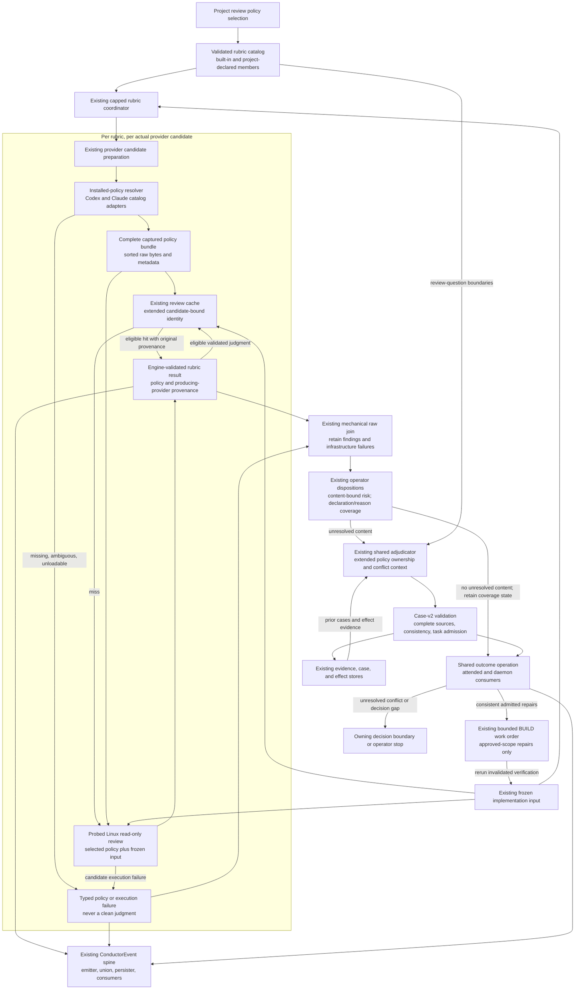

# Components: Portable, non-competing build review policy

**Last updated:** 2026-09-10
**Plan update approved:** James Stoup, 2026-09-11
**Scope:** Proposed review-domain boundaries for #1986, implementing the approved PRD and selected approach A. Diagram approval establishes these boundaries; detailed discovery, policy-contract, cache, and adjudication decisions remain subject to the full architecture review.
**Status:** Approved by operator, 2026-09-10

> **Amended 2026-09-10 by #1986:** Architecture review has approved the formerly open mechanisms: explicit native catalog adapters, complete captured bundles, Linux/bubblewrap read-only access, candidate-local cache ordering, and case-v2/shared outcome application. The plan assigns these boundaries to Tasks 1–40; prior statements that they await architecture review are historical.

## Diagram

## Boundary obligations

- The diagram represents one review lap with multiple independent rubric branches. Each branch receives the same immutable implementation input, its own policy, and no sibling findings or operator risk history.
- Provider preparation precedes effective policy resolution and cache lookup. Every fallback candidate repeats that boundary; a preferred candidate's policy identity cannot stand in for a different candidate's effective policy. Cache hits preserve the original producing judgment's provenance.
- Policy identity covers the effective skill and the supporting criteria used by it. Discovery precedence, package closure, and the mechanism that binds loaded bytes to execution are not settled by this diagram.
- Reviewer execution is read-only with respect to implementation input and original installed policies. Result collection is engine-owned. The full review must establish how this restriction is enforced on both hosts, rather than relying on a prompt.
- The raw join keeps content and infrastructure separate. A valid content finding remains visible when a sibling fails; autonomous adjudication cannot turn missing policy coverage into a clean judgment.
- The existing adjudicator owns semantic equivalence, conflicting remedies, and admission under the approved plan and review-question boundaries. Mechanical validation owns source completeness, valid state transitions, effect identity, and bounds; it does not infer semantic consistency from string matching.
- Only the aggregate authority directs repair or stops the review. No new adjudicator, lifecycle step, plan-appending authority, or independent rubric kickback is introduced. Existing empty/disabled behavior remains, and custom policy cannot bypass aggregate adjudication through an alternate configuration path.
- General custom-step portability remains outside this feature.

## Existing-source basis

Verified at baseline `faa8914fff74619fb8331877ba8040485a7c1352`: `build-review-inputs.ts` produces frozen source input; `build-review-coordinator.ts` coordinates rubric branches and cache callbacks; `provider-execution.ts` prepares the actual candidate before invocation; `build-review-adjudication-coordinator.ts` and `conductor.ts` implement the existing aggregate remediation path. The effective-policy resolver and the candidate-bound cache ordering are proposed changes, not current capabilities.

Governing constraints include `adr-2026-08-22-one-owner-per-review-question`, `adr-2026-08-22-build-review-opt-in-rubric-container`, and the amended shared-adjudication design. The full review must resolve the closed-membership and current cache-identity clauses before these extensions become authoritative.

## Event-spine verdict

Channel: review resolution, cache, judgment, and disposition occurrences. Verdict: extend the existing `ConductorEvent` union and consumer path. Exception C applies only to durable policy snapshots and existing review/case/effect evidence, which answer what is true now. No bespoke telemetry ledger, watcher, or parallel reader is proposed.

## Related diagrams

- [System context](projects-cannot-add-portable-non-competing-build-r-system-context.md)
- [Containers](projects-cannot-add-portable-non-competing-build-r-containers.md)
- [Policy resolution and fallback](sequences/projects-cannot-add-portable-non-competing-build-r-policy.md)
- [Finding adjudication](sequences/projects-cannot-add-portable-non-competing-build-r-adjudication.md)
- [Interrupted repair recovery](sequences/projects-cannot-add-portable-non-competing-build-r-recovery.md)

## Legend

Boxes are responsibilities rather than finalized module names. The candidate boundary repeats for each selected provider. An arrow to the aggregate carries evidence, not independent permission to cycle BUILD. No database is introduced, so an ERD is not applicable.

## Change Log

| Date | Change | Reason |
|------|--------|--------|
| 2026-09-10 | Initial proposed component boundaries | Approved product scope and approach A |
| 2026-09-10 | Plan-update: concrete candidate, authority, and recovery boundaries | Reflect the approved architecture and 40-task implementation plan |
