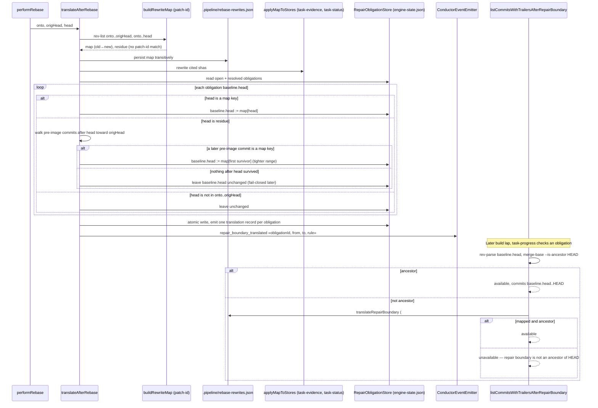

# Sequence: Repair-obligation boundary translation after an engine rebase

**Last updated:** 2026-09-18
**Scope:** How `translateAfterRebase` rewrites each persisted repair obligation's `baseline.head`
through the patch-id rewrite map, how a dropped or absorbed boundary (residue) resolves to a
surviving later commit, and how the read path in `autoheal.ts` keeps its fail-closed refusal
for anything the engine cannot explain.

## Diagram

## Legend

- **map key** — the boundary commit replayed onto the new base with an identical patch-id; the
  existing `resolveThroughMap` rule applies unchanged.
- **residue** — the boundary commit had no post-image patch-id match (squashed, absorbed into
  main, or content-changed). Its replacement is the post-image of the **first surviving commit
  after it** in pre-image order, so the evidence range can only shrink, never admit pre-repair
  history.
- **unchanged** — a boundary outside `onto..origHead`, or one with no surviving successor, is
  left as-is. The read path then refuses it exactly as today; that refusal is the intended
  fail-closed outcome, not a defect.
- The `#2544` read-path fallback in `autoheal.ts` is retained so an obligation written before
  this change, or a store the translation step could not rewrite, still resolves direct map hits.
- Translation is observable only through the existing event spine (`ConductorEventEmitter`);
  no sidecar or log line is added.

## Change Log

| Date | Change | Reason |
|------|--------|--------|
| 2026-09-18 | Initial generation | DECIDE for #2462, Approach A |
