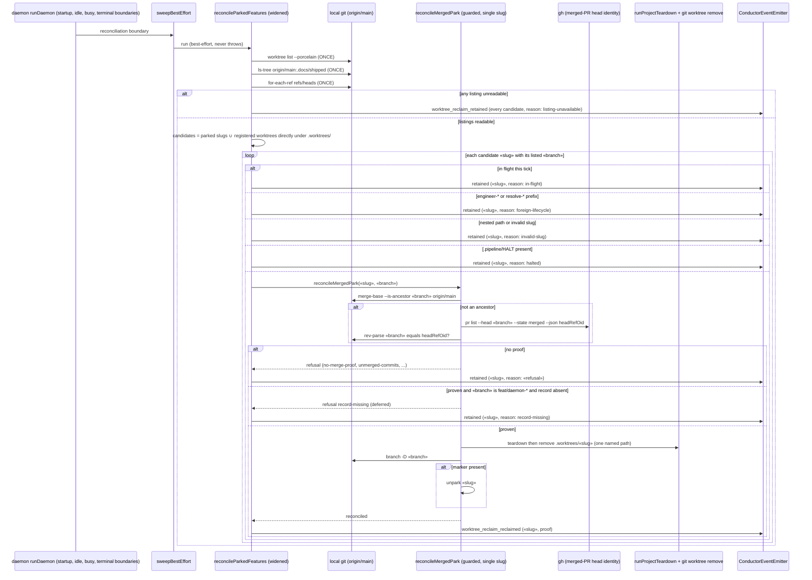

# Sequence: Filesystem-driven feature-worktree reclamation through the guarded helper

**Last updated:** 2026-09-14
**Scope:** How the parked-feature reconciliation sweep is widened to enumerate every git-registered
worktree under `.worktrees/`, how each candidate is excluded or handed one at a time to the
existing guarded single-slug helper, and how the helper's shipped-record precondition is scoped by
branch kind (#1510).

## Diagram

## Legend

- **`reconcileParkedFeatures` is widened, not duplicated.** Its candidate set was
  `listOperatorParkedSlugs` alone — 0 entries on this checkout while `.worktrees/` held 67
  registered worktrees. The union with the worktree listing is the whole change to the sweep's
  input; the helper, proofs, teardown invitation, and refusal taxonomy are the approved ones.
- **Enumeration is from `git worktree list --porcelain`, never `readdir`.** The listing supplies
  each worktree's real branch, and it makes nested paths (`.worktrees/feat/…`, live today)
  visible as what they are instead of as bogus `feat` slugs.
- **The helper takes the listed branch.** Today it resolves branches by the slug's final path
  segment, which misses `hotfix/x` for directory `hotfix-x` and `feat/daemon-<slug>` for
  directory `<slug>`. Passing the branch from the listing keys the multi-proof on the branch
  that actually backs the worktree.
- **Record precondition is scoped by branch kind.** A `feat/daemon-*` worktree still needs
  `.docs/shipped/<slug>.md` on `origin/main`, because the daemon backlog dedups on that record.
  Any other branch is reclaimed on merge proof alone; no dispatch depends on a record for it.
  Measured 2026-09-14: 10 of 67 worktrees carry a record; 23 more carry a MERGED PR and no
  record — the class #1510 lists.
- **Every removal names exactly one path.** The enumeration yields candidates; the helper still
  accepts one explicit slug, rejects lists and globs, and re-derives every proof immediately
  before the destructive step.
- **Retention is the default on every ambiguity.** Unreadable listings retain everything;
  in-flight, foreign-lifecycle, invalid-slug, halted, unproven, and record-missing all retain,
  each with a named reason. Nothing deletes on an indeterminate probe.
- **Outcomes ride the spine.** `worktree_reclaim_reclaimed | retained | failed` are appended to
  the `ConductorEvent` union, declared in `EVENT_SINKS`, and persisted; the daemon log line is a
  rendering, never the source of truth. Because a reclaimed worktree's own `events.jsonl` dies
  with it, the daemon-root ledger is the only durable forensic record of the reclaim.
- **Branch deletion stays.** The same proof that authorizes the worktree removal authorizes
  deleting the proven-merged branch; the helper already does it.

## Change Log

| Date | Change | Reason |
|---|---|---|
| 2026-09-14 | Initial diagram: a standalone filesystem sweep gated on shipped-record presence. | First shape before the repo-wide ADR sweep (#1510). |
| 2026-09-14 | Rewritten: widen `reconcileParkedFeatures` to feed the existing guarded helper; branch from the listing; record precondition scoped to `feat/daemon-*`. | The ADR sweep found an approved, wired reclaim helper whose only gap is its candidate set, and measured that record-only reclaims 10 of 67 while merge proof reclaims 33 (#1510). |
| 2026-09-14 | Plan-update pass: no structural change; task ids mapped — listing (T1), branch-keyed evidence (T2), record scope (T3), conditional unpark (T4), sweep widening (T5–T6), spine (T7–T8), config (T9), composition root (T10). | `/plan` §8b diagram update for #1510. |
