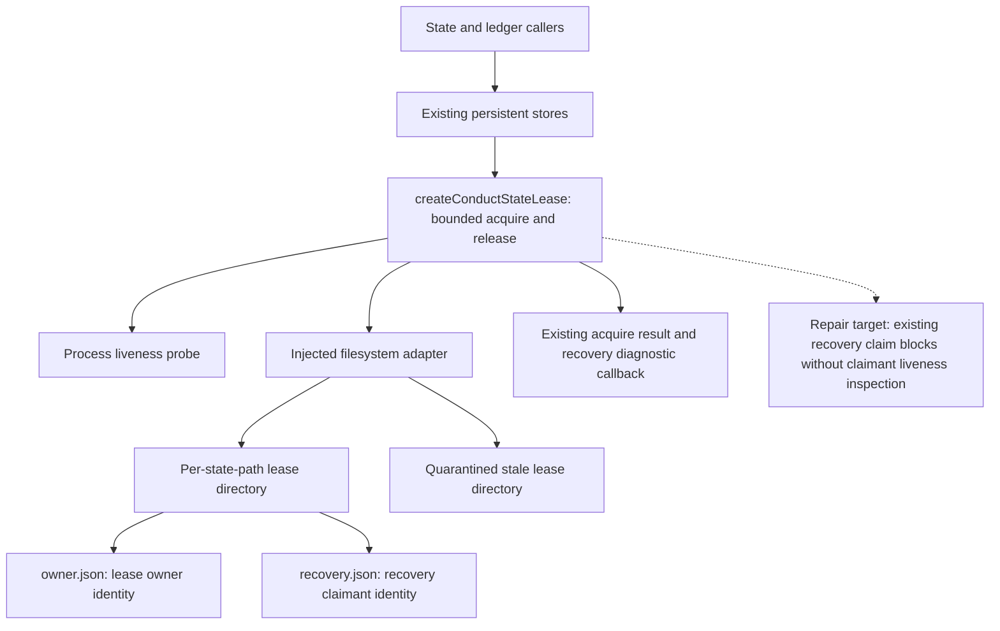
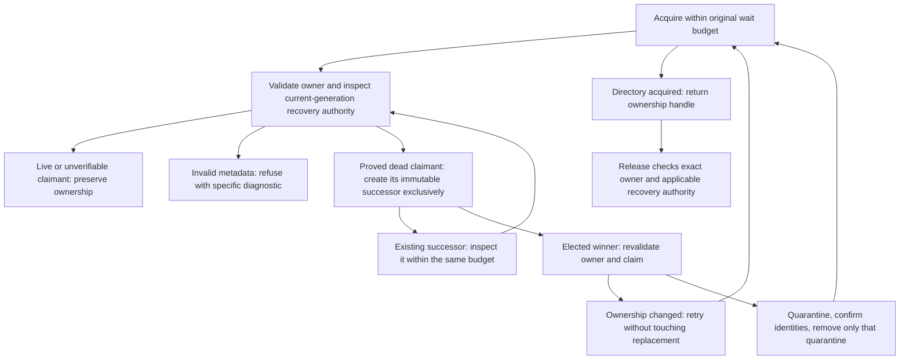

# Components: Shared conduct-state lease recovery

**Last updated:** 2026-09-11
**Scope:** Current shared lease boundary for #2170, with the recovery gap identified. Component connections are verified from source; the repair algorithm remains subject to architecture review.

## Diagram

## Legend

Solid arrows show existing calls or stored ownership records. The dotted arrow identifies the verified defect, not a new component. Lease paths derive from each protected state path, so unrelated worktrees and state stores do not share a lock. The full-suite lock is outside this diagram and this feature.

## Evidence

- `src/conductor/src/engine/conduct-state-lease.ts`: `createConductStateLease`, `recoverDeadOwner`, `defaultFilesystem`, and `ConductStateLeaseOptions` define these boundaries. On recovery-claim EEXIST, the implementation returns occupied with the already-dead owner's pid.
- `src/conductor/src/engine/filesystem-conduct-state-store.ts`, `engine-state-store.ts`, and `engineer/intake/ledger.ts` provide existing production callers. `remediation-case-store.ts`, `build-review-dispositions.ts`, `kickback-ledger.ts`, and `closeout-events.ts` also use this primitive.
- `adr-2026-08-01-conduct-state-mutation-port` requires bounded, exclusive, fail-closed mutation. `adr-2026-08-12-fail-closed-intake-ledger-durability` reuses the primitive for intake persistence.

## Event-spine check

Channel: no new reporting channel. Ownership and recovery claims are durable coordination state (exception C), not telemetry. Reuse existing acquire results and recovery diagnostic callbacks; do not add a watcher, bespoke log, or parallel event stream. Any later proposal for a new emitted diagnostic must follow the existing event union and consumer path.

## Change Log

| Date | Change | Reason |
|---|---|---|
| 2026-09-11 | Document shared lease components and current recovery gap | DECIDE for #2170 |

## Approved recovery flow reflected by the implementation plan

> **Amended 2026-09-11 by #2170:** The component graph above records the observed pre-change gap. The operator-approved recovery-succession ADR and the plan now define the repaired flow below; the existing component boundaries remain unchanged.

The implementation plan assigns the store-boundary proof to Task 2, competing ownership to Tasks 3–4, generation-aware release to Task 5, ambiguous metadata to Tasks 1/6, one deadline to Task 7, diagnostics to Task 8, and operation-specific failure protection to Tasks 9–10. This diagram is the approved mechanism expressed visually for plan review; it does not claim implementation is complete.

| Date | Change | Reason |
|---|---|---|
| 2026-09-11 | Add approved recovery flow within the existing component boundaries | Plan update after ADR approval |
