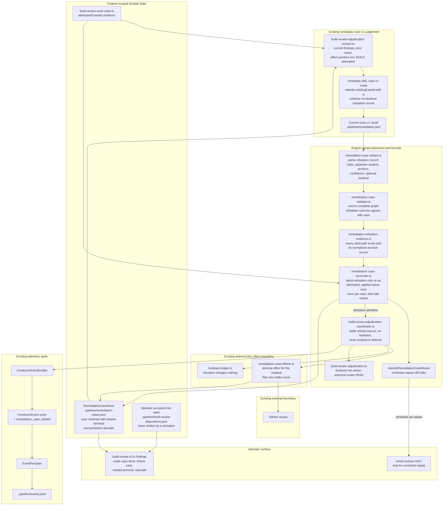

# Components: bounded refutation lane for a re-raised build_review case

**Last updated:** 2026-09-09
**Scope:** Proposed component boundaries for jstoup111/ai-conductor#2409: the existing case-v1
adjudicator gains one judge-authored terminal outcome for an already-attempted action case, the
engine admits it only under mechanical bounds, persists the rationale, renders it, and routes the
narrow residual through the existing deferral effect. Nothing new is added outside these seams.

## Diagram

## Legend

- **Judge** — the existing `remediate` case-v1 dispatch; it gains one representable move
  (a refutation record on an `existingCaseId`) and no new authority.
- **Admit** — engine-owned, deterministic. Admission is mechanical: attempted plus applied action
  case, once per case, `high` confidence, resolvable anchors. A judge that re-proposes `act` on the
  same case reaches `classifyRemediationCaseReuse` unchanged and halts as today.
- **Effects** — reused as-is. The refutation itself has no effect and consumes no kickback; the
  optional residual is an ordinary deferral effect.
- **State** — the case store gains a refuted terminal plus the persisted rationale; the operator
  disposition store is never touched by this lane.
- **Render** — `build-review findings` opens the case store for the first time.
- **Spine** — one new `ConductorEvent` member on the existing emitter/persister path.

## Change Log

| Date | Change | Reason |
|------|--------|--------|
| 2026-09-09 | Initial generation | DECIDE for jstoup111/ai-conductor#2409 |
| 2026-09-09 | Evidence node is a path-plus-excerpt resolver | Plan update: content-region hashes anchor test titles, not file content |
