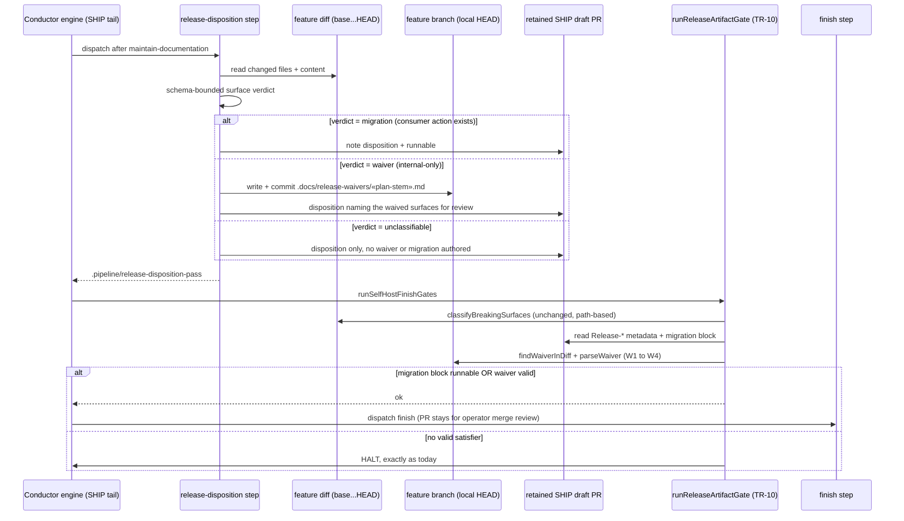

# Sequence: SHIP tail authors the release waiver the TR-10 gate validates

**Last updated:** 2026-09-22
**Scope:** How the self-host SHIP tail's `release-disposition` step turns its judgement of the real
feature diff into a committed, gate-valid release waiver (or a runnable migration block), and how the
unchanged fail-closed TR-10 release gate validates it before `finish` (#2230).

## Diagram

## Legend

- **release-disposition step** is the repository-local custom step configured in
  `.ai-conductor/config.yml` (`.agents/skills/release-disposition/SKILL.md`). New behaviour: its
  judgement is constrained to a three-value verdict, and a `waiver` verdict commits a waiver file
  to the feature branch, just as `maintain-documentation` already commits in the SHIP tail.
- **`.docs/release-waivers/`** is already on the always-allowed `.docs` write list
  (`DOCS_WRITE_ALWAYS_ALLOWED`, `phase-marker.ts`), so the step needs no new permission.
- **TR-10 gate** is unchanged as the fail-closed validator: the path classifier, W1 freshness (the
  waiver must be in `base...HEAD`), W2 format, W3 full coverage, and W4 (an uncertain change set is
  unwaivable) all still apply to whatever the step authored.
- **unclassifiable** authors nothing, so the gate halts with today's reason; a wrong `waiver`
  verdict is backstopped by the operator's PR-merge review (ADR-005/ADR-010, the daemon never
  merges).
- `«plan-stem»` is the feature's plan filename stem.

## Change Log

| Date | Change | Reason |
|------|--------|--------|
| 2026-09-22 | Initial sequence | #2230 — move waiver authoring into the SHIP tail |
