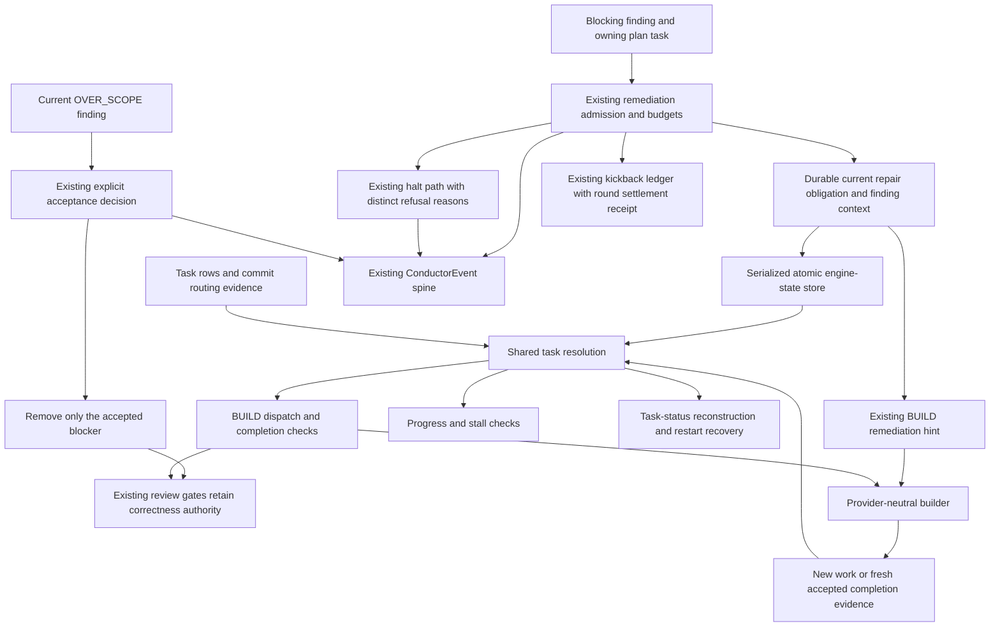

# Components: Reopened-task resolution

**Last updated:** 2026-09-06
**Scope:** Proposed component responsibilities for issue #1831, within the operator-approved shared-semantics scope. Persistence representation and freshness comparison are architecture-review decisions; this diagram does not select a new file or telemetry channel.

## Diagram

## Legend

All boxes except the builder are responsibilities inside the existing conductor runtime. The repair obligation is durable state describing unfinished work, not an event history. The shared resolver excludes pre-reopen completion for the bound task while preserving the legacy rules for untouched tasks. The builder receives the finding that caused reopening. Routing evidence never substitutes for review of the repaired behavior.

## Existing basis and review boundary

Verified in this checkout: `conductor.ts` restages bound rows before the D1 completion check; `task-progress.ts::resolveTaskIds` unions terminal rows with all matching branch trailers; `artifacts.ts` and `countResolvedTasks` consume that resolver; `task-seed.ts` reconstructs missing rows from branch trailers independently. These are the affected seams, not four independent definitions to maintain.

The July 23 trailer-union ADR requires one resolution definition and explicitly prohibits pinned-stamp and reachability machinery. Architecture review must resolve the bounded change to that contract before approving a concrete freshness design. The July 13 no-op guard and existing lap budgets remain applicable.

> **Amended 2026-09-06 by #1831:** Operator clarification: accepting a completed scope widening is a terminal resolution of that scope blocker, not a repair dispatch. The existing `accepted-widenings.ts::classifyOverScopeCriterion` is shared by scope routing and audit completion and remains authoritative for this decision. Independent defects remain blocking. Fresh valid task-close evidence may complete real repair without a new commit; subsequent review must judge the resulting behavior. Reopening and reclosing the same task cannot by itself manufacture progress or reset existing retry limits.

## Event spine

- Channel: no new telemetry channel. Any added observation extends the existing `kickback`/halt event path and `ConductorEvent` schema.
- Concern: the current repair obligation is durable state; admission/refusal is an occurrence.
- Verdict: preserve the existing event spine; select durable-state ownership during architecture review.
- Exception: C for current repair state. Do not reconstruct reopen timing from a bespoke timestamp log.

## Change Log

| Date | Change | Reason |
| --- | --- | --- |
| 2026-09-06 | Initial proposed component flow | Operator selected shared resolution and restart recovery for #1831 |
| 2026-09-06 | Explicit acceptance path and convergence constraint | Operator approved the flow and required acceptance to close completed scope work |

> **Amended 2026-09-06 by #1831:** The operator approved the component/sequence flow and its acceptance clarification. `adr-2026-09-06-reopened-task-resolution` now supplies the approved durable-state ownership, freshness, evidence-only closure, and failure-handling decisions that this diagram deferred to architecture review.

> **Amended 2026-09-06 by #1831:** Plan update: Tasks 1–3 own serialized engine-state and obligation transitions; Task 8 settles an admitted round with a receipt atomically alongside its lap delta in the existing kickback ledger. Tasks 4–6 wire resolution, seeding, and close; Tasks 7–11 wire acceptance, replay, termination, and existing diagnostics. These are durable state stores, not a new telemetry channel.
