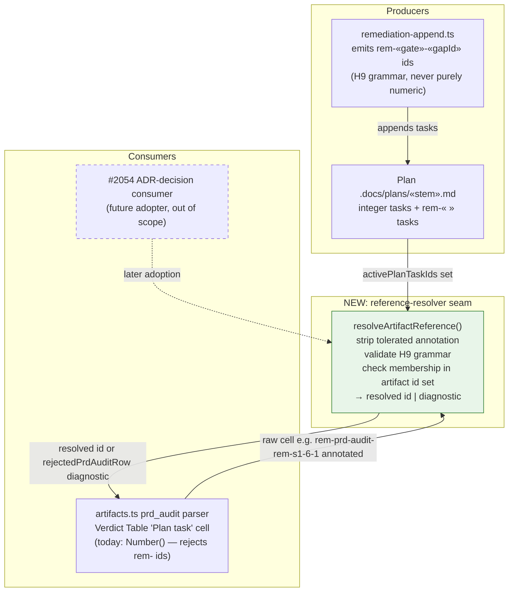

# Components: Shared plan-task reference resolver (#2064)

**Last updated:** 2026-08-30
**Scope:** The reference-resolver seam between remediation-append's H9 task-id producer and
prd_audit's Verdict Table consumer; contract shaped for later adoption by #2054's ADR-decision
consumer (adoption itself out of scope here).

## Diagram

## Legend

- Green node — new module introduced by this feature.
- Dashed node/edge — future adopter, not delivered here.
- «…» — variable segment placeholder.

## Change Log

| Date | Change | Reason |
|------|--------|--------|
| 2026-08-30 | Initial generation | DECIDE for #2064 |
