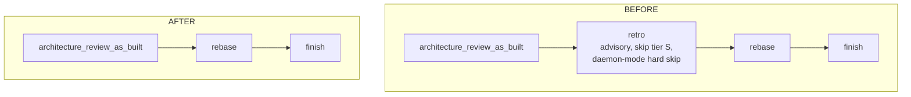
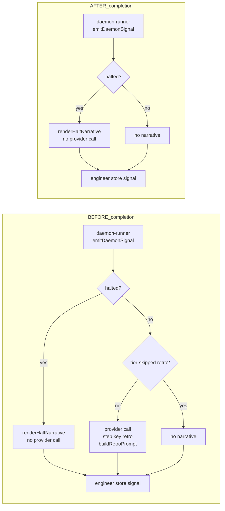
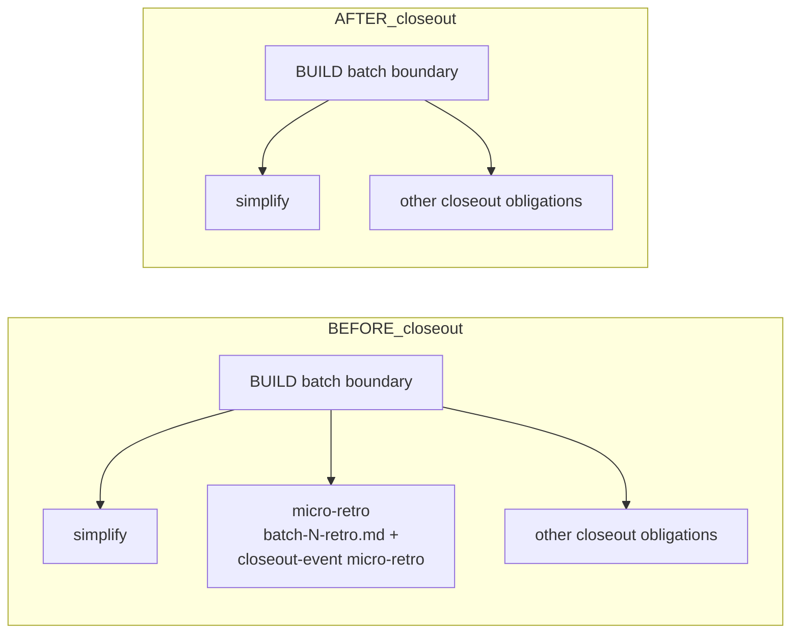
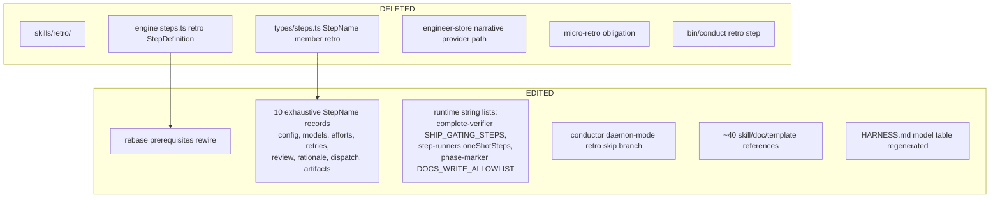

# Architecture: Remove Retrospectives (Full and Micro) from Feature Delivery

**Last updated:** 2026-08-26
**Scope:** The SHIP-tail step graph, daemon-completion narrative path, and batch-boundary closeout obligations, before and after the retro purge. Source: jstoup111/ai-conductor#1905.

## Diagram: SHIP tail — before and after

The `rebase → retro` prerequisite edge was introduced deliberately to serialize the ship tail
(#922, `.memory/decisions/serial-ship-tail-922.md`). Re-pointing `rebase.prerequisites` to
`architecture_review_as_built` preserves that fence: rebase still waits for the last review
step before publication; only the retro hop disappears.

## Diagram: daemon-completion narrative path — before and after

Halt narratives are diagnostic, not retrospective — they stay. The completion-time retro
provider call (`engineer-store.produceNarrative`, `buildRetroPrompt`, the `retro` routing key,
`tierSkippedRetro` threading, `daemon-runner.retroTierSkipped` event scan) is removed.

## Diagram: batch-boundary closeout — before and after

`micro-retro` leaves the `pipeline_closeout.obligation` event union and the
`CLOSEOUT_OBLIGATIONS` CLI allowlist in the same change (a lockstep pair under `satisfies`).
All downstream consumers (rollup, build-tail CLI, OTel, renderers) are obligation-generic
and need no change.

## Removal surface map (components deleted vs edited)

## Legend

- BEFORE/AFTER subgraphs show the same surface pre- and post-purge.
- DELETED = code/files that cease to exist; EDITED = surviving files losing their retro entries.
- Historical `.docs/retros/` reports and retro-era spec artifacts remain as records.
- Recovery anchor: git tag `retro-last` on the last pre-removal main commit.

## Change Log

| Date | Change | Reason |
|------|--------|--------|
| 2026-08-26 | Initial generation | DECIDE for #1905 retro purge |
