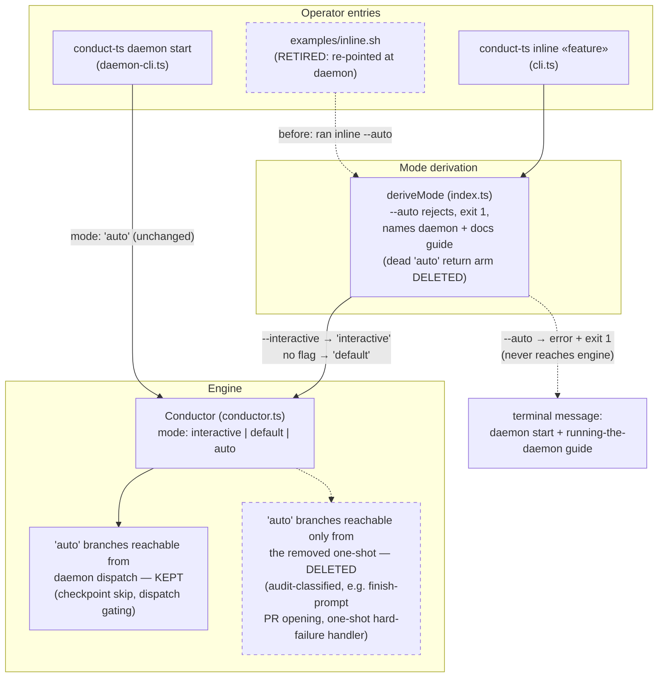

# Components: unattended execution paths after the one-shot removal

**Last updated:** 2026-08-26
**Scope:** The two entry paths into the inline engine's run modes, showing what this
feature deletes versus what stays as the daemon's contract. Feature slug:
`remove-the-unattended-one-shot-inline-run-auto-the` (jstoup111/ai-conductor#1436).

## Diagram

## Legend

- Solid arrows: surviving paths (unchanged behavior).
- Dashed arrows / dashed nodes: paths this feature deletes or retires.
- The `'auto'` RunMode value itself is **kept** — it is the daemon's dispatch contract
  (daemon-cli.ts passes `mode: 'auto'`). Only branches unreachable from the daemon go.
- `«feature»` marks a variable argument.

## Change Log

| Date | Change | Reason |
|------|--------|--------|
| 2026-08-26 | Initial generation | DECIDE for #1436 (engineer spec) |
