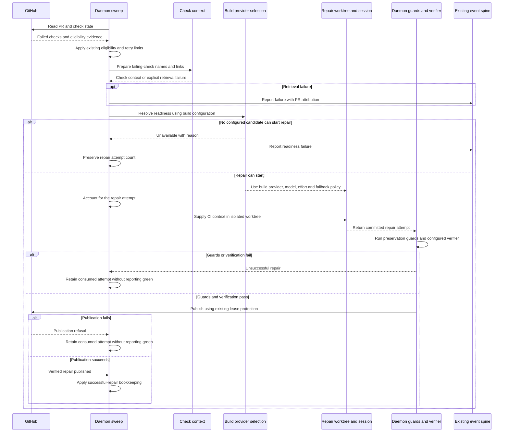
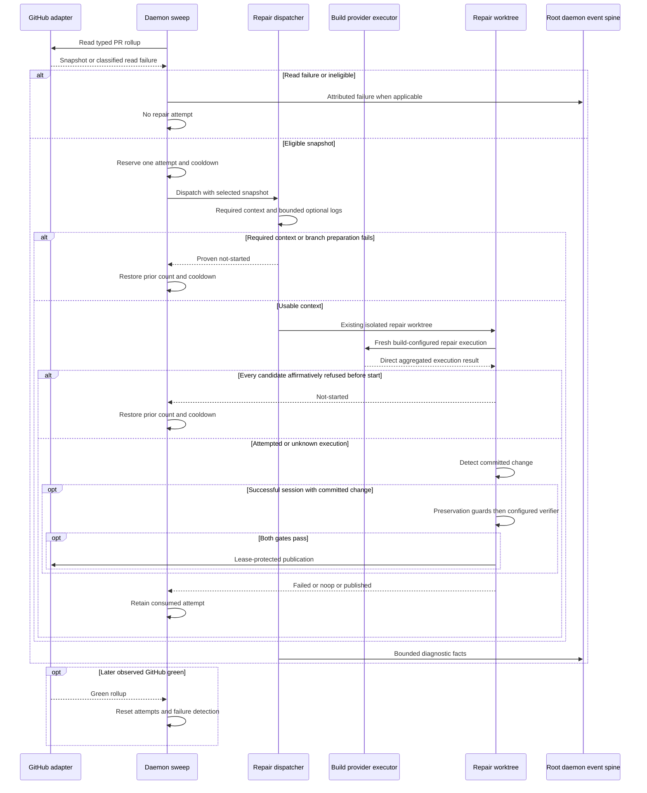

# Sequence: Reliable CI repair dispatch

**Last updated:** 2026-09-11
**Scope:** Proposed correction to the existing daemon CI-repair flow for jstoup111/ai-conductor#2153 and the operator-approved adjacent dispatch defects.

## Diagram

## Legend and boundaries

All participants except GitHub and the selected provider execute within the existing engine and its isolated repair worktree. Build provider selection denotes the existing provider-aware execution policy, not a new service or independent CI-repair configuration. Readiness and actual dispatch must agree on that policy; the diagram does not prescribe a second probe implementation.

The diagram distinguishes prevention of a session from an unsuccessful session. A failed guard, failed verifier, or failed push must never be converted to a successful-repair result. Existing CI eligibility, concurrency, cooldown, and retry-limit protections remain in force.

Retrieval failures are observable and distinct from a successful empty check result. Architecture review will settle how available evidence is retained and whether a particular retrieval failure permits repair; no blind-success interpretation is allowed.

The successful-repair branch denotes daemon verification and publication, not proof that subsequent remote CI has passed. GitHub remains the authority for later remote check results.

> **Amended 2026-09-11 by #2153:** The successful-repair bookkeeping branch retains the consumed attempt. Only a later green GitHub observation resets the counter, as required by `adr-2026-07-07-ship-ci-feedback-loop` decision 3. Local verification and publication are not that observation.

## Event-spine decision

Channel: no separate channel; use existing event infrastructure for added diagnostics. Concern: occurrences (context retrieval or provider-readiness failures). Verdict: reuse or extend the ConductorEvent union and existing persistence/consumer path. Exception: none. The diagram and spec are durable design state, not occurrence telemetry.

## Change Log

| Date | Change | Reason |
|------|--------|--------|
| 2026-09-11 | Proposed CI-repair dispatch sequence | Expanded issue scope and operator-selected build configuration inheritance |

## Plan refinement

> **Amended 2026-09-11 by #2153:** The plan resolves the earlier conceptual diagram's open ordering: the sweep reserves before repair git work, the provider boundary owns readiness, and direct no-start proof restores count/cooldown. Required-context errors defer, optional-log failures degrade, and local publication retains the attempt. The refined sequence below governs implementation; the original diagram remains as the approved design history.

| Date | Change | Reason |
|------|--------|--------|
| 2026-09-11 | Added governing plan refinement in this file | Make reservation, direct no-start refunds and remote-only reset explicit for the 12 implementation tasks |
