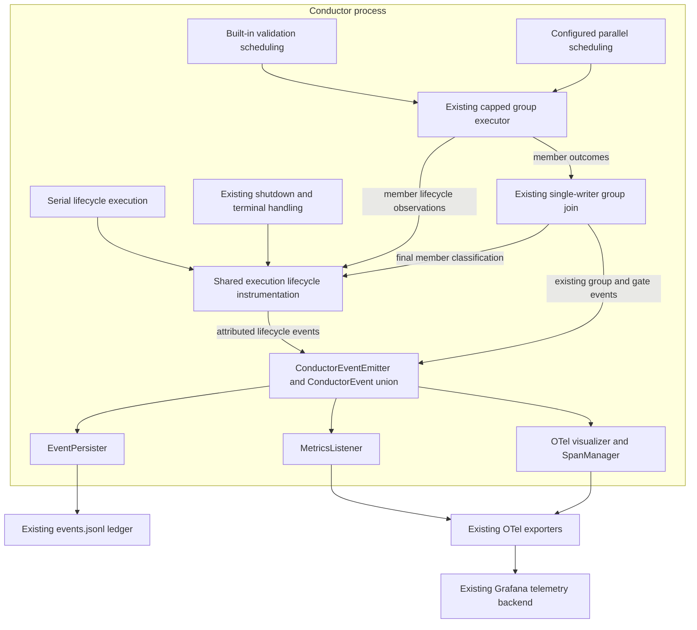

# Components: Sequential and parallel step telemetry parity

**Last updated:** 2026-09-10
**Scope:** Shared instrumentation for serial lifecycle execution, built-in validation groups, and configured parallel groups. Approved by the operator with the architecture proposal on 2026-09-10.

## Diagram

## Legend

The shared instrumentation is a logical responsibility, not a requirement to introduce a new class or executor. It reuses the conductor's existing tracked lifecycle delivery where suitable. Each scheduling path supplies its execution identity and observations. Gate/state commits remain owned by the existing serial machinery or group join; telemetry does not grant completion authority.

The ledger retains the ConductorEvent schema. No sidecar, poller, dashboard change, or separate metrics channel is proposed. Existing event consumers are shown at component level; architecture review must resolve backward-compatible identity and terminal semantics before implementation tasks are authored.

The approved plan resolves member timing with an attributed group_member_step settlement observation before handshake/join work. Timing consumers freeze that member's finish boundary; the join later supplies the final terminal classification without extending its elapsed work. EventPersister remains the owner of persisted activeInterval evidence. The lifecycle identity resolver is shared by producers and consumers; metric recording remains exclusively in MetricsListener.

## Design constraints for architecture review

- Begin a parallel member's measured lifecycle when it actually enters execution, excluding time queued behind the concurrency cap. Close its measured work when that member settles, excluding slower siblings and join delay.
- Match the serial contract for retries, failure/refusal, and shutdown; do not reset a logical execution's elapsed duration on each provider attempt.
- Retain both configured parent-group identity and member identity without pretending arbitrary branch names are registered lifecycle steps.
- Correlate concurrent and repeated executions so late terminal events cannot close a different execution. Keep unbounded execution IDs out of metric dimensions.
- Preserve dispatch/cost accounting without counting both lifecycle completion and provider_attempt as separate invocations.
- Cover all three entry paths with behavioral tests using fake providers and in-memory telemetry exporters. No live backend calls in automated tests.

## Event spine

Channel: no new channel; shared instrumentation emits on the existing bus.
Concern: occurrences in time, with execution identity and terminal disposition.
Verdict: extend existing lifecycle event contracts as required, within ConductorEvent and its existing consumers.
Exception: none.

## Change Log

| Date | Change | Reason |
| --- | --- | --- |
| 2026-09-10 | Initial component diagram | Operator selected shared instrumentation and technical track for #2414 |
| 2026-09-10 | Show join-to-lifecycle final classification | Plan preserves member finish time while retaining authoritative gate outcomes |
