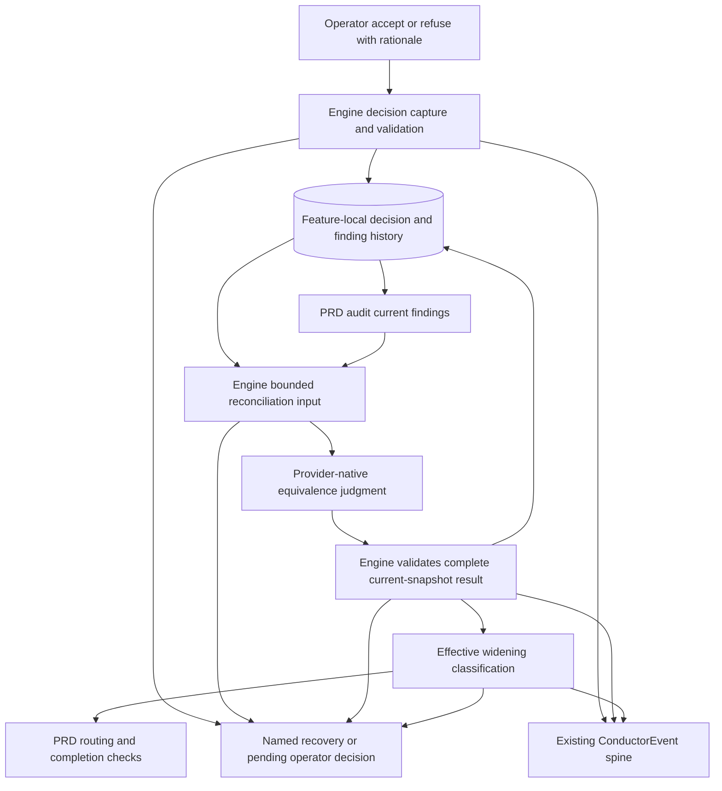
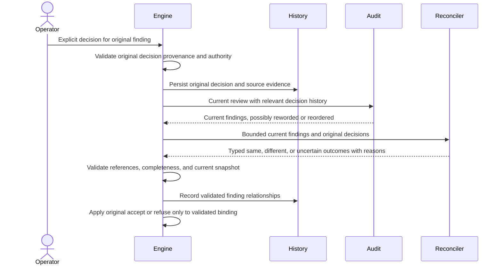
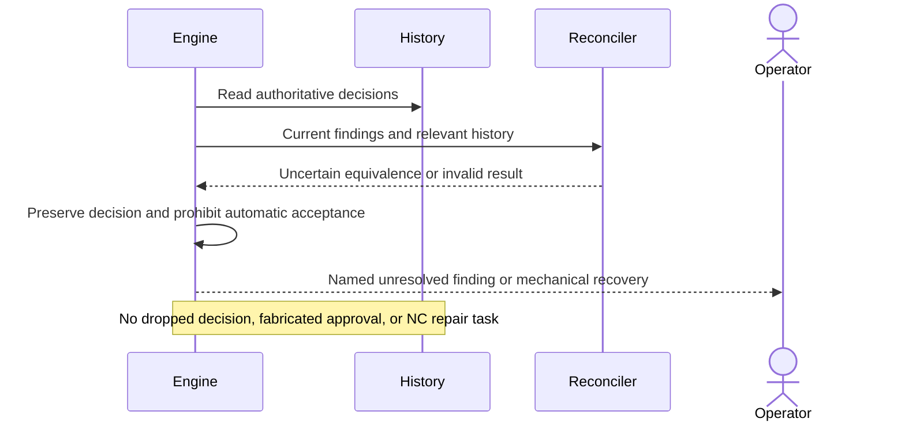
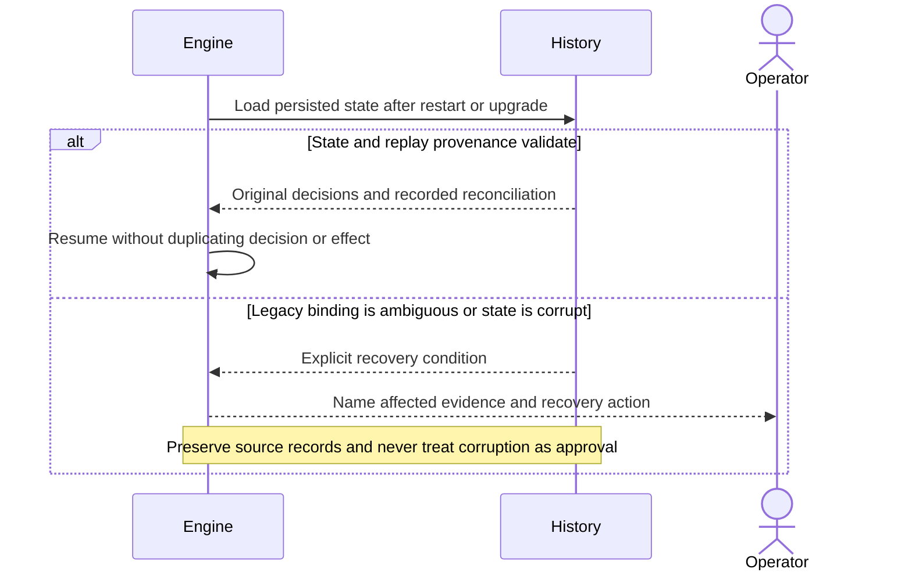

# Components and sequences: Durable PRD-audit widening decisions

**Last updated:** 2026-09-07
**Scope:** Proposed logical architecture for #2429, operator-approved logical flow. Complete PRD widening lifecycle only; no cross-gate effects or budget changes.

## Component diagram

## Original decision capture and later wording drift

## Ambiguous finding or invalid reconciliation

## Restart and legacy recovery

**Diagram approval:** Operator accepted the flow in composer on 2026-09-07. Detailed architecture decisions are reviewed separately.

## Authority and boundaries

The operator alone authors accept/refuse decisions. The judge relates findings; it cannot create, reverse, or widen operator authority. A known refusal remains blocking for the same reported widening. A new or uncertain widening requires its own decision. Story-criterion decisions retain criterion-based authority.

Capture is logically prior to reconciliation: a new report cannot veto importing an otherwise valid decision about the original finding. This includes already-cleared legacy decisions; precise provenance and migration rules belong to architecture review.

Completion consumes validated effective classification and current evidence; it must not independently re-derive identity from summary similarity. A stale reconciliation cannot authorize changed input. Malformed current rows and incomplete history remain visible blockers.

The drawing names logical responsibilities, not separate new services or a second judge dispatch. Approved adr-2026-09-07-durable-prd-widening-decision-reconciliation D1-D10 settles those responsibilities. The 24-task plan uses the existing remediate dispatch with a native schema request, distinct PRD case records in the shared store, separate operator decisions, and one common effective classification. Capture/publication acquire case-store then decision-store leases when both are needed; no provider call holds a lease.

## Legend

Rectangles are logical engine/review responsibilities; the cylinder is durable feature-local state. The only external judgment boundary uses the selected provider's native contract. Events use ConductorEventEmitter -> ConductorEvent -> EventPersister; history is state under the event-spine durable-state exception.

## Verified basis

At 33ad7de51, `routeCurrentPrdAuditOverScope` passes current report summaries into `parseClearedOverScopeDecisions` before persisting decisions. `accepted-widenings.ts` uses summary equivalence at import and classification and treats malformed stores as absent. `remediation-case-artifact.ts` and its store accept only build_review. The approved mixed-build-review ADR preserves the predecessor's domain-owned authority and source-complete judgment pattern; it does not by itself approve extending that schema here.

## Change Log

| Date | Change | Reason |
|------|--------|--------|
| 2026-09-07 | Initial components and three sequences; plan wiring clarified | Operator-approved history-backed approach and ADR for #2429 |
