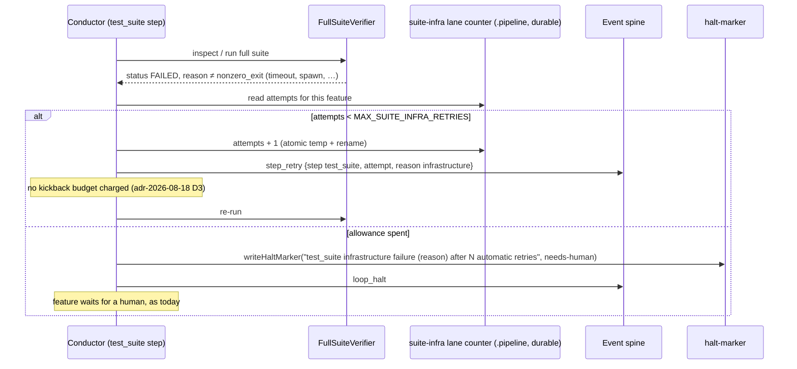
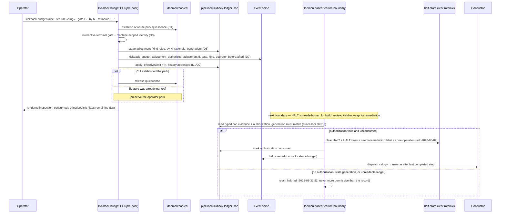

# Sequences: suite-infra bounded lane and kickback-budget recovery (#2190)

**Last updated:** 2026-09-05
**Scope:** The two resume paths this feature delivers — a bounded in-step retry for a test_suite
infrastructure failure, and the operator budget-recovery command with the daemon-side clear — as
approved by architecture-review under adr-2026-08-18 and adr-2026-08-29.

## Flow 1 — test_suite infrastructure failure → bounded lane → needs-human

## Flow 2 — operator raises the budget, daemon clears the halt

## Legend

- «…» — variable segment placeholder.
- Flow 1 charges nothing against the kickback budget and derives escalation from `attempt`
  (adr-2026-07-05 §7); the counter is durable across dispatches like `MAX_MECHANICAL_FAULT_LAPS_BUILD_REVIEW`.
- Flow 2: the CLI never removes the halt (D6). `reset` follows the same path with `consumed → 0`
  instead of `effectiveLimit + N` (D2).
- Live-boundary trips and seal errors have no flow here: they are excluded (fail-closed by design).

## Change Log

| Date | Change | Reason |
|------|--------|--------|
| 2026-09-05 | Initial generation (DEFERRED + laps-grant flows) | DECIDE for #2190 |
| 2026-09-05 | Rewritten to suite-infra lane + kickback-budget recovery | architecture-review resolution R + absorb |
