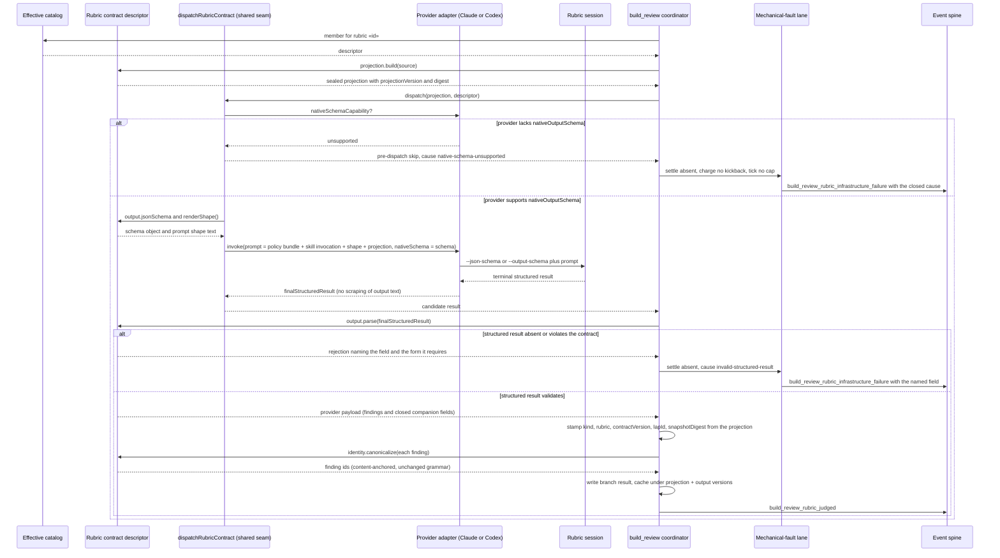

# Sequence: build_review rubric dispatch through the native output schema

**Last updated:** 2026-09-22
**Scope:** One rubric branch from catalog lookup to settled result, for any member (`testQuality`,
`security`, `custom-v1`). Shows the native-schema request, the structured-result validation with a
field-named rejection, and the two new mechanical-fault causes. Cache-hit and fresh-base exits are
unchanged and elided.

## Diagram

## Legend

- **Effective catalog** — built-in registry members and resolved custom-policy members. Both hand
  back the same descriptor shape. Built-in members run through the coordinator as drawn; `custom-v1`
  is routed through `dispatchInstalledBuildReviewPolicy`, which calls the same `dispatchRubricContract`
  seam (ADR D1.3).
- **Rubric contract descriptor** — the projection builder, the output JSON Schema, the parser, and
  the identity canonicalizer for one member. `renderShape()` derives the prompt text from the
  schema, so the shape the model is shown and the shape the engine validates cannot diverge.
- **Provider adapter** — the existing `nativeSchema` seam from adr-2026-09-07 D6. Claude passes
  `--json-schema`; Codex writes an engine-owned schema file under the invocation scratch home and
  passes `--output-schema`.
- **Mechanical-fault lane** — the existing lane. `native-schema-unsupported` and
  `invalid-structured-result` are added to the total closed branch-reason mapping
  (adr-2026-08-18-mechanical-rubric-faults D2). Neither is a semantic verdict.

## Change Log

| Date | Change | Reason |
|------|--------|--------|
| 2026-09-22 | Initial generation | Spec for #2384 — typed rubric output on the native-schema seam |
| 2026-09-23 | Rename fault event to `build_review_rubric_infrastructure_failure`; name the shared seam | ADR D1.3 clarification after as-built AB-1 |
