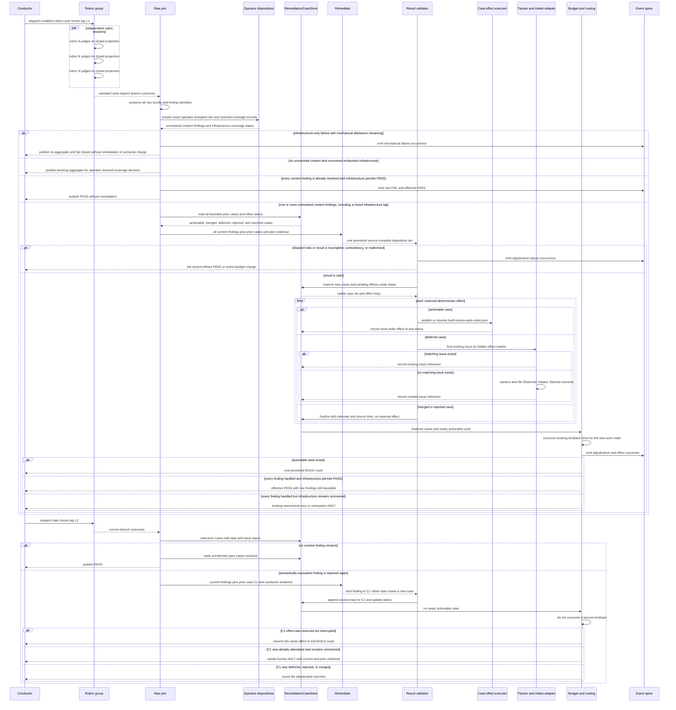

# Sequence: one build_review remediation fan-in across current and prior outcomes

**Last updated:** 2026-08-29
**Scope:** One failed multi-rubric lap, source-complete `remediate` synthesis, deterministic effects,
and a later lap that recognizes prior cases without re-litigating or double-charging them.

## Diagram

## Invariants

- The group waits for every enabled rubric to settle before the raw join. One malformed or failed
  branch cannot erase valid sibling outcomes.
- Infrastructure inability is not a semantic finding and never reaches `remediate` as repairable
  content. Below its allowance it publishes no aggregate. At exhaustion it remains blocking until
  exact operator reduced coverage resolves it; only then may content siblings enter `remediate`.

> **Amended 2026-08-29 by #2033:** “publishes no aggregate” applies to an infrastructure-only lap.
> Valid content siblings on a mixed lap enter `remediate`; one admitted actionable route takes the
> semantic charge while infrastructure stays independently blocking. With no action route,
> infrastructure follows its existing retry/exhaustion path and only healing or exact operator
> reduced coverage can permit PASS.

- `remediate` sees current findings and bounded prior case history in one fresh session. It returns
  judgement only; the engine stamps identities and performs effects.
- Every current raw finding is traceable to exactly one case outcome. A merge retains all source
  identities rather than replacing them with one untraceable summary.
- Deferred issue publication is retry-safe: the engine reserves a stable effect marker before the
  call and searches for that marker before creating an issue after any retry or crash.
- A repeated equivalent case never consumes a second kickback. A crash-interrupted work-order effect
  resumes idempotently; a case already attempted by BUILD and still present halts instead of becoming
  either a newly charged lap or an unlimited free loop. The cumulative route bound remains intact
  because every actual first-time BUILD kickback still increments it.
- Raw rubric evidence, operator acceptance, autonomous adjudication, and the effective gate verdict
  remain separately inspectable.

## Change Log

| Date | Change | Reason |
|------|--------|--------|
| 2026-08-29 | Initial proposed sequence | DECIDE architecture input for issue #2033 |
| 2026-08-29 | Route mixed-lap content without clearing infrastructure | Conflict-check resolution preserves sibling findings and existing mechanical authority |
| 2026-08-29 | Bind sequence participants to planned state/effect seams | Plan-update pass |
