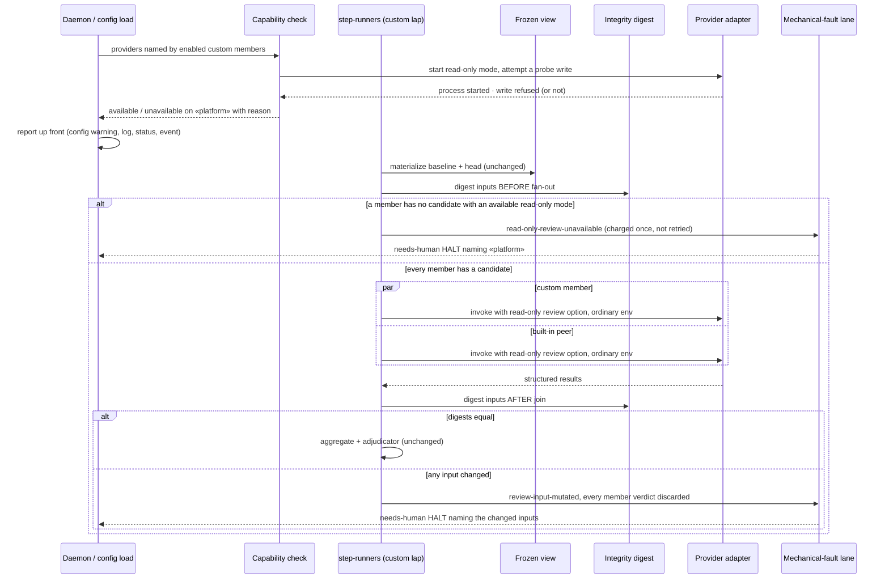

# Sequence: a custom-policy build_review lap under provider read-only review mode

**Last updated:** 2026-09-24
**Scope:** One `build_review` lap containing an enabled custom rubric, from the up-front capability
check through the integrity verdict. Adjudication, caching, dispositions and the aggregate are
unchanged and shown only as their entry point.

## Diagram

## Legend

- `par` blocks run concurrently over one shared frozen view, which is why a digest mismatch discards
  the whole lap rather than one member.
- A candidate whose read-only mode is unavailable is treated like an unavailable provider, and the
  next candidate in the member's policy is tried. Only a member with no candidate left produces the
  closed cause.

## Change Log

| Date | Change | Reason |
|------|--------|--------|
| 2026-09-24 | Initial generation | #2735 DECIDE |
