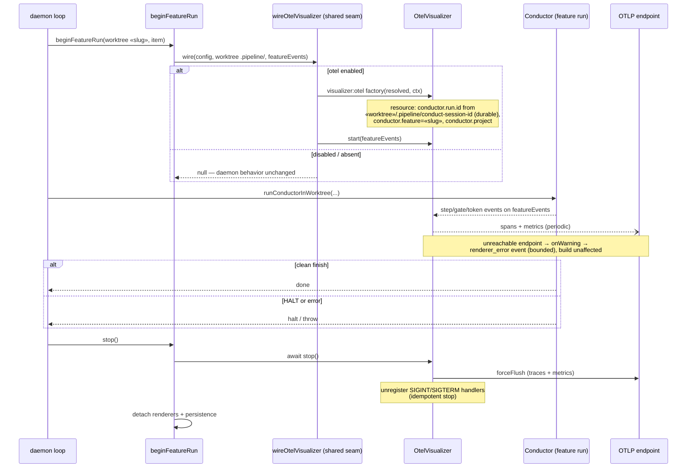

# Sequence: Daemon dispatch with per-feature OTel visualizer

**Last updated:** 2026-08-26
**Scope:** Lifecycle of one daemon feature dispatch with OTel enabled — attach, emit, and
flush-on-end (clean, HALT, or error). Source: #1934.

## Diagram

## Legend

- Flush rides `beginFeatureRun`'s existing `stop()`, which the daemon already invokes on every
  dispatch end — so HALT and error paths flush without new plumbing.
- A later re-dispatch of the same feature repeats this sequence in a possibly different daemon
  process; the durable `conduct-session-id` gives both dispatches the same `conductor.run.id`.

## Change Log

| Date | Change | Reason |
|------|--------|--------|
| 2026-08-26 | Initial generation | DECIDE for #1934 |
