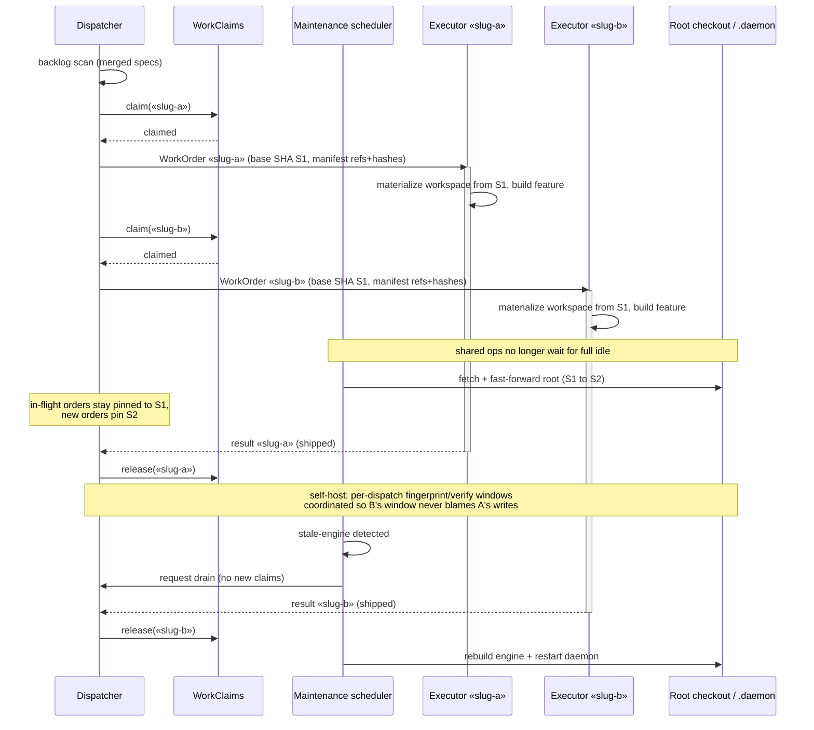

# Sequence: Two concurrent feature builds in one daemon (N=2)

**Last updated:** 2026-08-27
**Scope:** The target dispatch flow for issue #568 — claim, work-order manifest, concurrent executors, non-starving shared maintenance, and interleaving-correct live-boundary windows.

## Diagram

## Legend

- `«slug»` is a per-feature placeholder.
- WorkOrder is a serializable struct; executors receive identities and a document manifest, never root paths or live objects.
- At the default concurrency of 1 this flow degenerates to today's serial daemon: one claim at a time and maintenance runs between builds exactly as it does now.

## Change Log

| Date | Change | Reason |
|---|---|---|
| 2026-08-27 | Initial N=2 dispatch sequence | DECIDE architecture for issue #568 |
