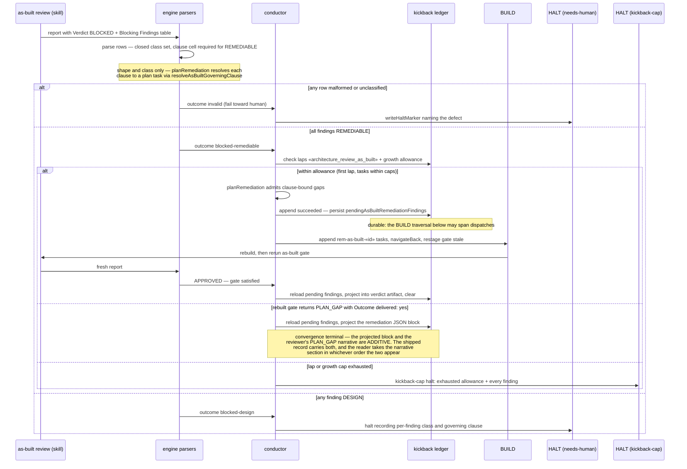

# Sequence: As-Built BLOCKED — Remediable Convergence vs Design Halt

**Last updated:** 2026-08-26
**Scope:** issue #1874 — the two BLOCKED paths after per-finding classification, plus the
fail-closed and cap-exhaustion terminals.

## Diagram

## Legend

- «architecture_review_as_built» — the new gate key in the existing gate-keyed ledger.
- Two terminal classes, not one: DESIGN findings and an invalid report halt `needs-human`;
  cap exhaustion, a second lap, and a no-op escalation halt `kickback-cap`. Every
  `kickback-cap` body lists each finding with its class and governing clause.
- A surviving finding never loops: the second lap is a halt, not another remediation.
- The operator can read afterward which findings were remediated and against which approved
  clause (verdict artifact + shipped record projection).
- That record survives a restart because the pending set is durable ledger state (ADR decision
  7); it is cleared by the same step that projects it, so it never outlives the projection.
- A remediation lap and a delivered PLAN_GAP are not alternatives
  (`adr-2026-08-22-as-built-review-runs-always-with-plan-gap` D2). Both reach the shipped
  record; neither preempts the other.

## Change Log

| Date | Change | Reason |
|------|--------|--------|
| 2026-08-25 | Initial generation | DECIDE for issue #1874 |
| 2026-08-26 | Added the pending-findings persist and project-then-clear steps | Operator amendment approving ADR decision 7 (as-built finding AB-D1) |
| 2026-08-26 | Added the kickback-cap terminal; corrected where clause binding happens | As-built drift notes: exhaustion is kickback-cap, and the parser validates shape only |
| 2026-08-26 | Added the delivered-PLAN_GAP convergence branch | AB-R10: remediation and a delivered PLAN_GAP coexist additively |
