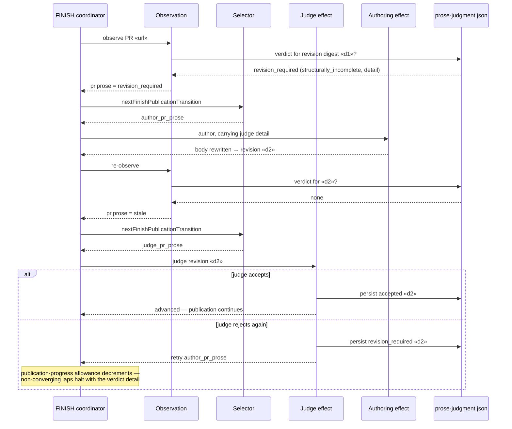

# Sequence: FINISH prose author→judge revision lap (issue #2006)

**Last updated:** 2026-08-28
**Scope:** one FINISH dispatch encountering authored PR prose the judge finds deficient —
before (deadlock) and after (bounded revision lap).

## Diagram — after the fix

## Legend

- «d1», «d2» — sha256 digests of the observed title/body revision; the persisted-verdict key.
- The pre-fix deadlock: observation had no `revision_required` state, so the selector said
  `judge_pr_prose` while the judgment's retry said `author_pr_prose`, and
  `reconcileSelectablePublicationRetry` halted `publication_transition_unmoved` forever at
  zero provider cost (cached verdict).
- The reconcile guard still halts when a transition genuinely leaves its state unchanged —
  e.g. an authoring pass that produces the identical revision.

## Change Log

| Date | Change | Reason |
|------|--------|--------|
| 2026-08-28 | Initial generation | DECIDE for issue #2006 (spec authoring) |
