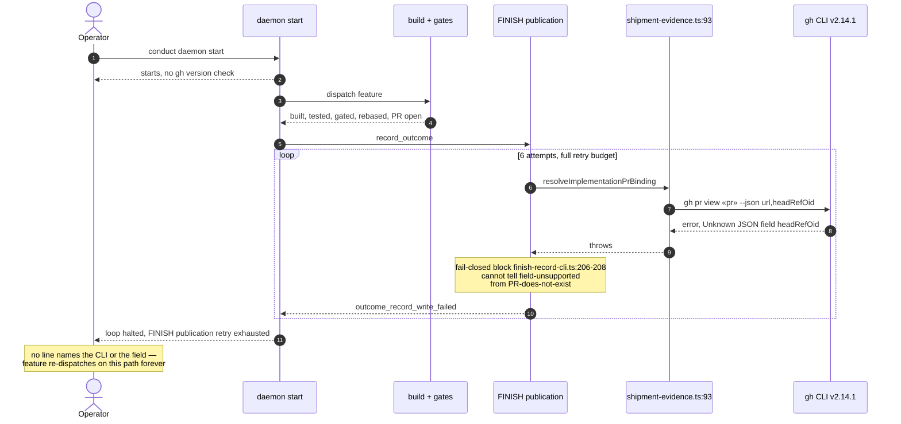
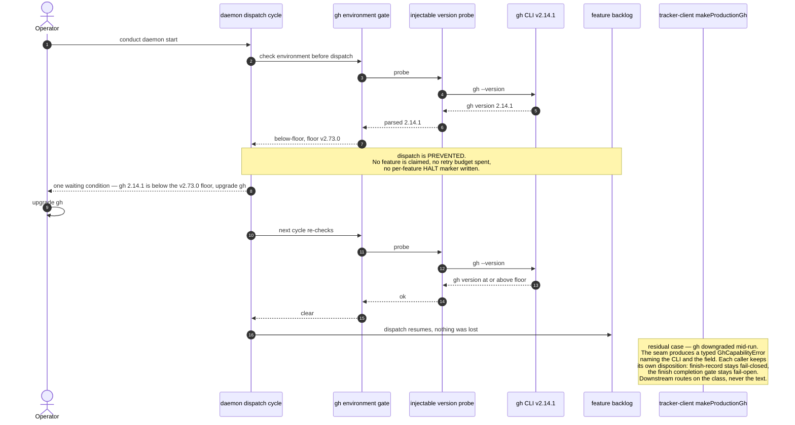

# Sequence: an under-floor `gh`, today and after

**Last updated:** 2026-09-05
**Scope:** The two flows that change for jstoup111/ai-conductor#2139 — the current path, in which
an old `gh` is discovered only at FINISH and burns the full retry budget, and the target path, in
which the same CLI is refused at startup. Anchors are at `main` `e54f1ba4e`.

## Diagram: today (the defect)

## Diagram: target

## Legend

- Guillemets `«…»` mark variable text.
- The first diagram is current behavior at `e54f1ba4e`, reproduced in the intake issue against a
  real `gh` 2.14.1. It is drawn to be deleted, not maintained.
- The decisive difference is not the wording of the failure but *who owns it*: today a machine-wide
  environment defect is recorded against one feature and re-dispatched forever; in the target it
  never reaches a feature at all.
- The seam translation is a second line of defence for a `gh` that changes under a running daemon.
  The floor gate is what keeps a retry budget from being spent.

## Change Log

| Date | Change | Reason |
|------|--------|--------|
| 2026-09-05 | Initial generation | DECIDE for jstoup111/ai-conductor#2139 |
| 2026-09-05 | Target reshaped from refuse-to-start to a dispatch-preventing environment gate | Repo-wide ADR sweep + operator's infrastructure-failure framing |
