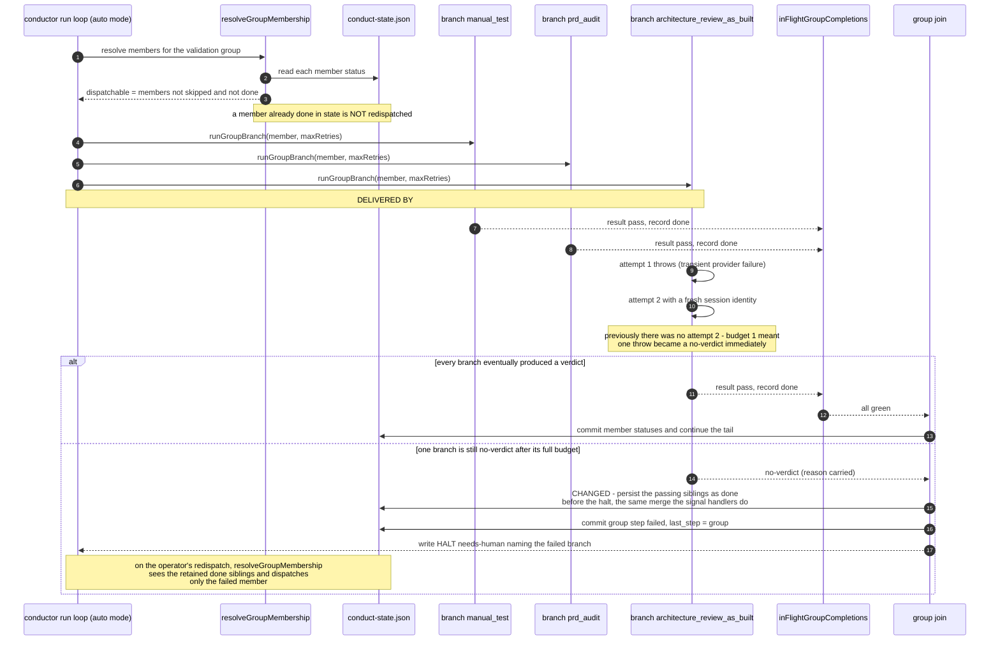

# Sequence: Validation-group branch retry budget and sibling retention (#1425)

**Last updated:** 2026-09-06
**Scope:** The auto-mode SHIP validation-group fan-out and its no-verdict halt path —
`conductor.ts` group dispatch (`runWithConcurrency` over `runGroupBranch`), the
`inFlightGroupCompletions` side-channel, and the `no-verdict` halt block. Two changes
are marked CHANGED; everything else is the existing engine.

## Diagram

## Legend

- **CHANGED** — the edit this feature makes (sibling retention). **DELIVERED BY #2190** — the retry-budget edit, built on PR #2206; this spec is blocked by #2190 and assumes it.
- **maxRetries** — the trailing argument to `runGroupBranch`. The serial walk resolves
  `max_retries` per step (default `FALLBACK_RETRIES = 3`); the group path passed a
  literal `1`, so a single throw produced a `no-verdict` with no second attempt.
- **`inFlightGroupCompletions`** — the in-memory side-channel that records a member's
  completion as soon as its own branch settles. The SIGINT/SIGTERM handlers already
  merge it into state; the no-verdict halt path did not, which is why green siblings
  were re-run after an operator cleared the halt.
- **The halt itself is unchanged.** `adr-2026-07-10-validation-group-join.md` chose
  "verdicts join, infra fails fast" deliberately, so a genuine no-verdict still halts
  the group loudly rather than being retried indefinitely.
- **BUILD-repair re-verification is unchanged.** `resolveGroupMembership`'s
  `reverifyDoneMembers` flag still forces every non-skipped member to dispatch after a
  repair, so a retained `done` can never mask a member that must re-run.
- `«…»` — placeholder for a variable value.

## Change Log

| Date | Change | Reason |
|------|--------|--------|
| 2026-09-06 | Initial generation | DECIDE phase for #1425 spec |
| 2026-09-06 | Budget change re-attributed to #2190 | conflict-check found the accepted #2190 Story 1 already delivers it |
| 2026-09-06 | Confirmed against the implementation plan (8 tasks); retention predicate named (`memberSatisfiedAtJoin`), one atomic commit | /plan step 8b |
