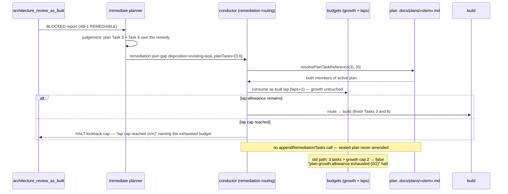

# Sequence: existing-task disposition through the as-built remediation gate (#2119)

**Last updated:** 2026-08-31
**Scope:** The false-halt path from #2119 and its replacement — a REMEDIABLE finding whose remedy
existing plan tasks already own, routed without drawing plan-growth allowance.

## Diagram

## Legend

- «…» — variable segment placeholder.
- An unresolvable cited task id (not in the active plan) is a validation failure of the
  disposition, handled like other malformed gaps — never a silent append.

## Change Log

| Date | Change | Reason |
|------|--------|--------|
| 2026-08-31 | Initial generation | DECIDE for #2119 |
