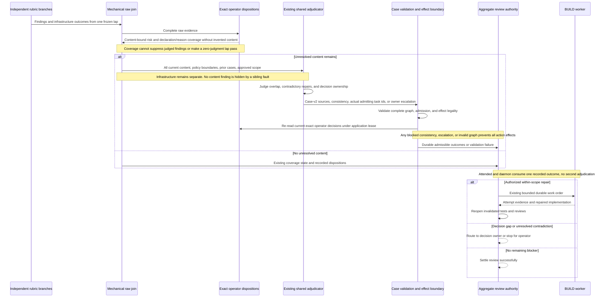

# Sequence: One consistent review outcome

**Last updated:** 2026-09-10
**Plan update approved:** James Stoup, 2026-09-11
**Scope:** Proposed custom-policy integration with existing adjudication for #1986; diagram approved by operator 2026-09-10.

> **Amended 2026-09-10 by #1986:** Tasks 24–35 implement separate accepted-risk/coverage matching, complete case-v2 context and validation, decision-owner stops, and the single shared attended/daemon outcome operation. Missing coverage remains unjudged and cannot substitute for accepted findings.

## Diagram

## Legend

The adjudicator supplies schema-constrained semantic judgment. The engine checks source completeness and authorizes effects; it does not derive semantic equivalence from finding text. Operator accepted risk remains a separate authority. Policy loading and infrastructure cannot become successful coverage through autonomous semantic disposition. No rubric or adjudicator directly appends a plan task.

## Change Log

| Date | Change | Reason |
|------|--------|--------|
| 2026-09-10 | Initial aggregate sequence | Preserve one authority and expose contradictory-policy handling |
| 2026-09-10 | Plan-update: concrete candidate, authority, and recovery boundaries | Reflect the approved architecture and 40-task implementation plan |
