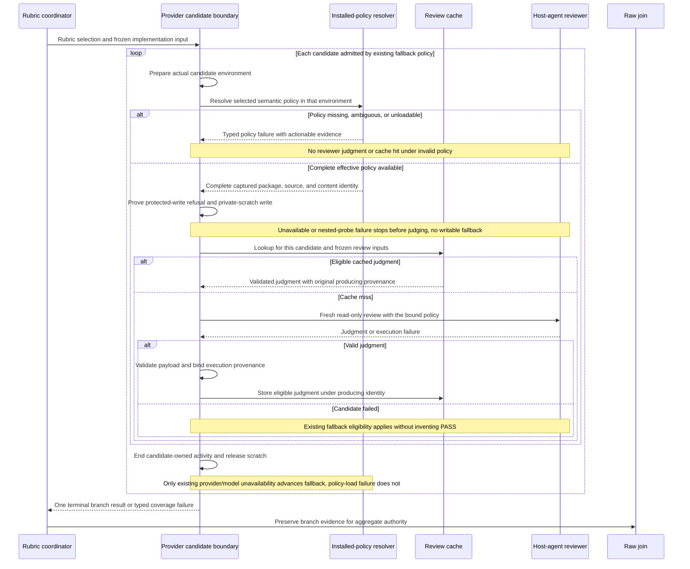

# Sequence: Policy resolution, cache reuse, and fallback

**Last updated:** 2026-09-10
**Plan update approved:** James Stoup, 2026-09-11
**Scope:** Proposed normal and negative candidate flows for #1986; diagram approved by operator 2026-09-10.

> **Amended 2026-09-10 by #1986:** Tasks 3–20 now fix the previously open loading/fallback rules: policy-loading failures do not become provider unavailability, each actual candidate resolves and hashes its complete delivered package before cache access, containment is proven before review, and every terminal path releases candidate activity.

## Diagram

## Legend

The loop exits on a valid settled result. A failure advances only when existing provider policy and the approved new failure classification allow fallback. The diagram requires re-resolution for every actual candidate; it does not pre-decide which policy faults are recoverable. Cache entries are judged evidence, not substitutes for proving the current candidate's effective policy.

## Change Log

| Date | Change | Reason |
|------|--------|--------|
| 2026-09-10 | Initial candidate sequence | Address effective-provider identity and unsupported-policy negatives |
| 2026-09-10 | Plan-update: concrete candidate, authority, and recovery boundaries | Reflect the approved architecture and 40-task implementation plan |
