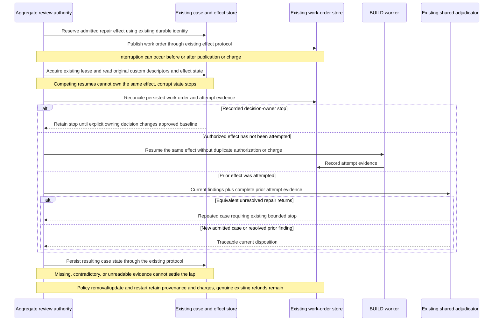

# Sequence: Recovery after interrupted review repair

**Last updated:** 2026-09-10
**Plan update approved:** James Stoup, 2026-09-11
**Scope:** Existing durable-effect behavior preserved as custom policies enter review; diagram approved by operator 2026-09-10.

> **Amended 2026-09-10 by #1986:** Tasks 35–39 reuse existing leased/atomic recovery and charge ownership. Stored custom descriptors survive policy removal, unresolved decision stops survive restart, and only explicit owning decisions permit re-evaluation. Genuine existing rebase refunds and operator reset semantics remain.

## Diagram

## Legend

This diagram preserves existing case identity, effect reservation, budget, and replay ownership; it does not introduce a second recovery ledger. The precise existing crash-state transitions remain authoritative and must be reviewed before any extension. Custom rubric identifiers and policy changes must retain enough evidence for that protocol to judge continuity without confusing a changed policy with repeated implementation work.

## Change Log

| Date | Change | Reason |
|------|--------|--------|
| 2026-09-10 | Initial recovery sequence | Carry PRD restart guarantees across custom policy evidence |
| 2026-09-10 | Plan-update: concrete candidate, authority, and recovery boundaries | Reflect the approved architecture and 40-task implementation plan |
