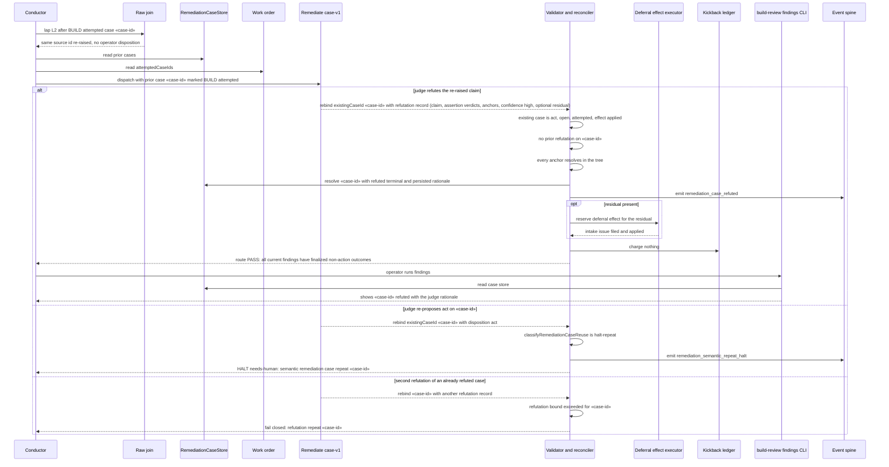

# Sequence: a re-raised build_review finding is refuted and settled, or halts as a genuine repeat

**Last updated:** 2026-09-09
**Scope:** The lap after BUILD attempted a remediation case: the rubric re-raises the same source,
the judge either refutes the claim under the bounded lane or re-proposes action; the engine settles
or halts accordingly and makes the outcome visible.

## Diagram

## Legend

- **Refuted branch** — the only new path. Every admission check is engine-side and mechanical;
  the judge supplies the judgement, the schema constrains it.
- **Repeat branch** — unchanged from today; proves the lane cannot wave through an unrefuted repeat.
- **Second refutation** — the once-per-case bound; a judge that keeps refuting the same case cannot
  loop.

## Change Log

| Date | Change | Reason |
|------|--------|--------|
| 2026-09-09 | Initial generation | DECIDE for jstoup111/ai-conductor#2409 |
