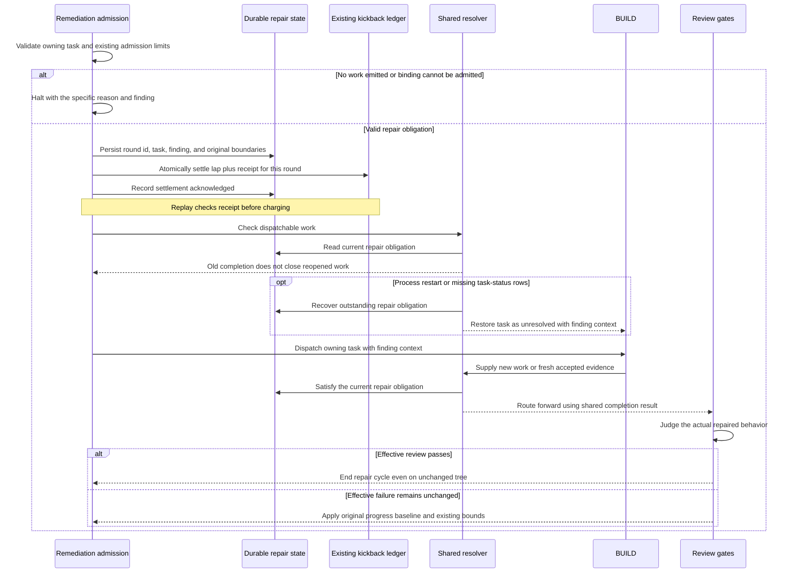

# Sequence: Repairing a previously completed task

**Last updated:** 2026-09-06
**Scope:** Admission, restart recovery, and renewed completion for an explicitly reopened task. Logical sequence for architecture review; no storage format is prescribed here.

## Diagram

## Legend

Persistence precedes dispatch so a process restart cannot forget admitted work. Duplicate handling must not manufacture a new repair obligation on every retry; a later admitted finding may reopen the task again. Untouched task completion and existing no-progress safeguards remain in force. Architecture review owns the exact freshness witness, persistence ordering, and failure handling.

> **Amended 2026-09-06 by #1831:** This repair sequence is entered only for still-actionable repair. An explicit acceptance of the current `OVER_SCOPE` finding follows the existing decision reducer before repair admission: record acceptance, remove that blocker, and continue if no independent blocker remains. It neither creates a repair obligation nor requires a new commit. A later audit confirming repaired behavior or valid acceptance ends the loop. Repeated failure still uses the existing no-progress and lap limits; the pending-to-complete status cycle is not progress by itself. Replay after restart reuses the same obligation and preserves both acceptance and retry accounting.

## Change Log

| Date | Change | Reason |
| --- | --- | --- |
| 2026-09-06 | Initial proposed repair sequence | Make dispatch and restart behavior reviewable for #1831 |
| 2026-09-06 | Clarified terminal acceptance and no-progress behavior | Operator's explicit convergence requirement |

> **Amended 2026-09-06 by #1831:** The operator approved the component/sequence flow and its acceptance clarification. `adr-2026-09-06-reopened-task-resolution` now supplies the approved durable-state ownership, freshness, evidence-only closure, and failure-handling decisions that this diagram deferred to architecture review.

> **Amended 2026-09-06 by #1831:** Plan update makes replay concrete: persist the round first, atomically write its lap delta and receipt in the existing ledger, then acknowledge settlement. A crash between stores replays the receipt. PASS terminates; unresolved failure retains the original bounds.
