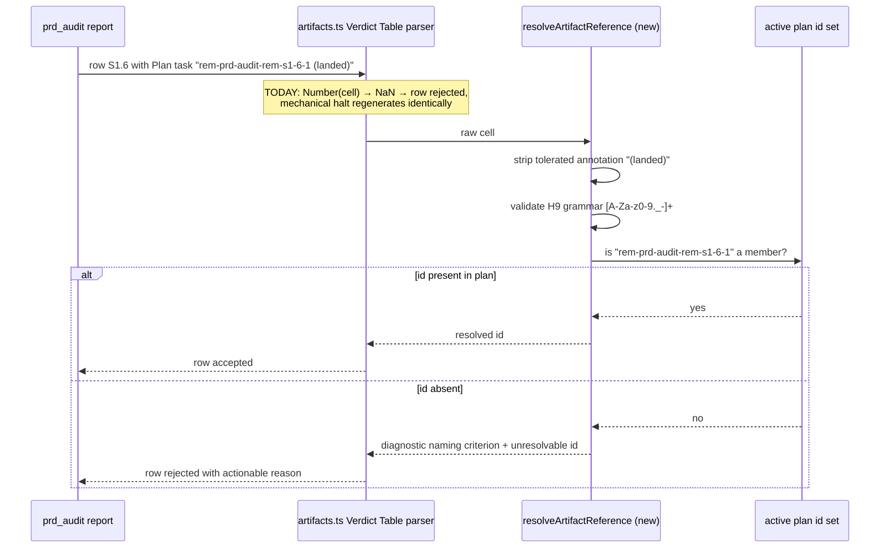

# Sequence: Verdict Table plan-task citation resolution (#2064)

**Last updated:** 2026-08-30
**Scope:** prd_audit report parse citing an engine-appended remediation task, before and after
the resolver seam.

## Diagram

## Legend

- «…» — variable segment placeholder.
- The "TODAY" note shows the defect path this feature removes.

## Change Log

| Date | Change | Reason |
|------|--------|--------|
| 2026-08-30 | Initial generation | DECIDE for #2064 |
