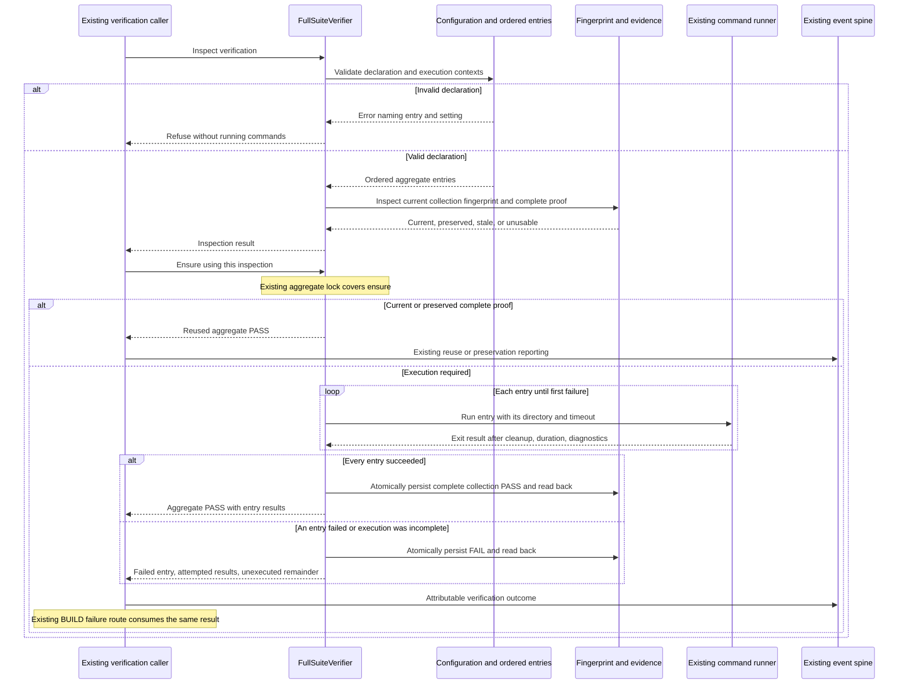

# Sequence: Support multiple test suites in BUILD

**Last updated:** 2026-09-11
**Scope:** Aggregate execution, proof reuse, invalid configuration, and first-failure handling for #2358.
**Review status:** Approved by James Stoup in composer chat, 2026-09-11.

## Diagram

## Legend

- Verifier-to-runner arrows include the ordered executor responsibility shown in the component diagram; they do not introduce a second process runner.
- A timeout, signal, launch failure, or nonzero exit ends the collection. Later entries do not run and cannot be represented as passing.
- A persistence/read-back failure is a verifier failure, never an aggregate PASS, even after all processes exit successfully.
- The reuse path launches no command. Existing freshness and drift-budget rules remain authoritative; any declaration change belongs to unbudgetable project-configuration drift.
- Preflight failure evidence and lock ownership retain the existing verifier's behavior. The invalid-declaration branch abbreviates that machinery and shows the required no-execution outcome.
- A run interrupted before durable completion cannot create reusable collection proof. No partial-pass resume cache is introduced.

## Change Log

| Date | Change | Reason |
|---|---|---|
| 2026-09-11 | Proposed ordered execution and attributable terminal result flow | Preserve proof and failure semantics while adding multiple suites |
