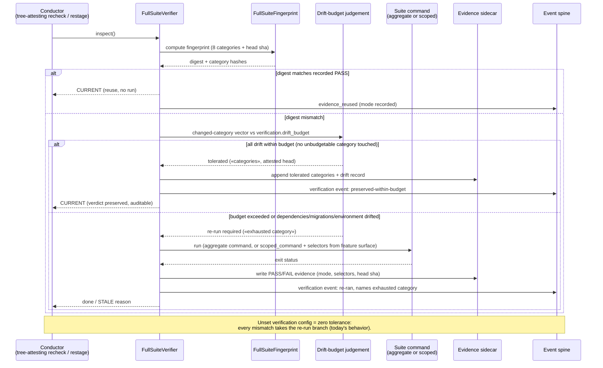

# Sequence: test_suite evaluation under a drift budget

**Last updated:** 2026-08-28
**Scope:** One gate evaluation after a tree-changing event (BUILD task, foreign main-side rebase), showing the inspect-always / tolerate-within-budget flow and where the mode becomes visible (issue #2021).

## Diagram

## Legend

- `B` is a pure function over the inspected category diff and declared budget — it never skips
  the fingerprint read that precedes it.
- The kickback path is unchanged: only a `nonzero_exit` from `X` charges the BUILD kickback
  budget; a within-budget tolerance never reaches `X`, so foreign drift alone can no longer
  burn a kickback.

## Change Log

| Date | Change | Reason |
|------|--------|--------|
| 2026-08-28 | Initial generation | DECIDE phase for issue #2021 |
