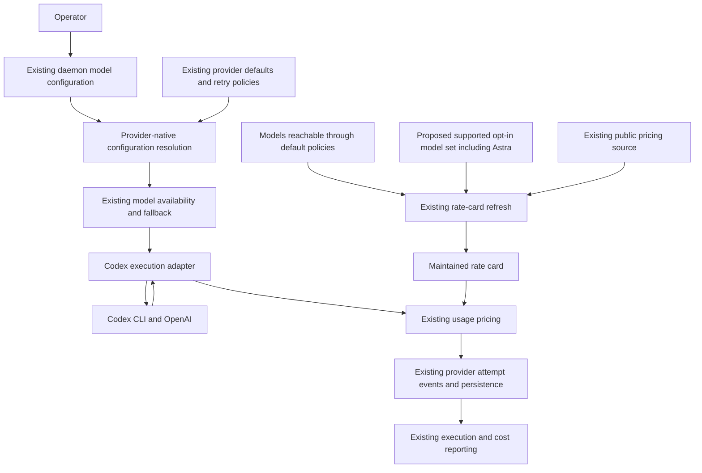

# Components: Support Astra in the daemon

**Last updated:** 2026-09-10
**Scope:** Opt-in Astra selection and maintained pricing in the existing daemon. Extension approved by architecture review and the operator.

## Diagram

## Legend

Solid arrows show existing data or control dependencies, including the proposed opt-in-model input to refresh. The opt-in model set is the proposed addition; its placement is an architecture-review decision. It does not feed default selection, automatic escalation, or default fallback ladders.

## Behavior and boundaries

- The operator selects `gpt-6-astra` using existing Codex model configuration. Normal configuration precedence remains authoritative.
- Existing availability handling tries the selected model and applies the effective fallback ladder when the provider reports model unavailability. Authentication, rate-limit, and expired-session recovery retain their existing ownership.
- Existing retry escalation leaves a model outside the default escalation order unchanged while applying the normal effort policy. Astra need not enter the default escalation order to be configurable.
- The proposed supported opt-in set extends the rate-card refresh selection independently of model defaults. Refresh continues reporting missing upstream rates; dispatch remains unmetered when no usable rate exists.
- Pricing and actual-model identity use existing reporting paths. No new event schema or sidecar is proposed. The rate card is durable state, not a telemetry channel.
- This is a component view of existing runtime containers. There is no new service, database, external integration, or deployment boundary requiring an additional container or entity diagram.

## Evidence and review questions

Verified against `src/conductor/src/engine/model-availability.ts`, `escalation.ts`, `provider-model-policy.ts`, `rate-card-cli.ts`, and `src/conductor/src/execution/rate-card.ts`.

Architecture review must resolve the placement of opt-in model metadata and the limitations of published-rate estimates. In particular, the existing rate card represents flat token rates, while official Astra pricing includes request-size and processing-mode modifiers. Do not imply that aggregate CLI token totals establish exact provider billing.

## Change Log

Plan-update review: the single implementation task in `support-astra-in-the-daemon.md` adds the opt-in pricing input shown above. Existing selection, fallback and pricing paths remain compatibility evidence. The diagram shows functional boundaries only.

| Date | Change | Reason |
|------|--------|--------|
| 2026-09-10 | Initial component view | Operator approved configurable Astra support with unchanged defaults and automatic pricing coverage |
