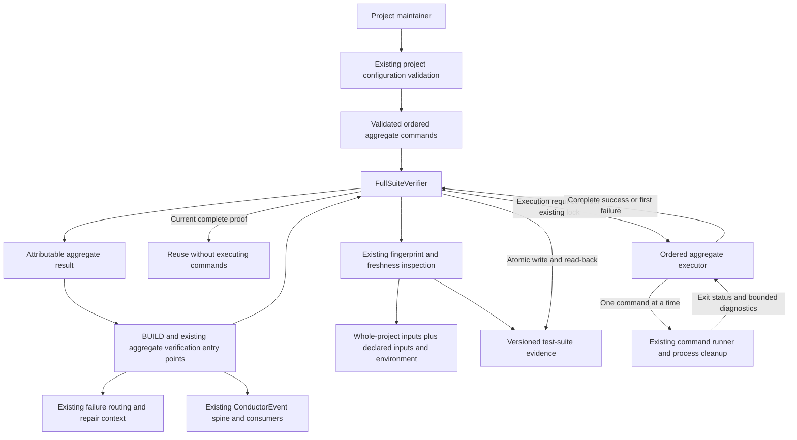

# Components: Support multiple test suites in BUILD

**Last updated:** 2026-09-11
**Scope:** Proposed extension of the existing aggregate verifier for jstoup111/ai-conductor#2358; Medium tier. No new service, provider transport, test-runner adapter, or database.
**Review status:** Approved by James Stoup in composer chat, 2026-09-11.

## Diagram

## Legend

- Boxes represent component responsibilities, not a requirement for one new file per box.
- Every command is project-owned. The process runner does not recognize test frameworks or parse their output to decide success.
- Validation and resolved entry semantics are shared by fingerprinting and execution so they describe the same ordered collection.
- Execution stays inside the existing aggregate lock. The executor stops at the first failure and finishes process cleanup before returning. One completed collection produces one aggregate verdict.
- Evidence includes attempted entries and the declared collection size so callers can distinguish completed, failed, and unexecuted entries. Only complete success may attest to the collection.
- Existing inspection-only consumers keep inspecting evidence; they do not become execution owners.
- The existing scoped route is not shown as a changed component. A selected scoped run remains on its existing invocation path; its existing empty-selection aggregate fallback reaches this ordered executor.

## Event-Spine Decision

Channel? No additional channel: extend the existing event schema for attributable suite outcomes.
Concern: Execution outcomes are occurrences; gate proof is durable state.
Verdict: Existing ConductorEvent union and persistence path for outcomes; retain the existing test-suite evidence artifact for proof.
Exception: C applies to gate evidence only. Reporting must not reconstruct execution occurrences by polling that artifact.

## Verified Existing Boundaries

- `engine/config.ts` validates suite settings and project-root containment.
- `engine/full-suite-verifier.ts` owns inspection, locking, execution selection, evidence persistence and read-back, and the aggregate verdict.
- `engine/full-suite-executor.ts` uses the injected command runner and existing process-tree cleanup.
- `engine/full-suite-fingerprint.ts` already enumerates tracked and non-ignored untracked inputs from the project root, together with declared inputs and environment.
- `engine/test-suite-cli.ts`, `engine/conductor.ts`, and existing inspection consumers use the verifier.

## Change Log

| Date | Change | Reason |
|---|---|---|
| 2026-09-11 | Proposed ordered command collection within the existing verifier | Deliver all suite-agnostic requirements of #2358 |
