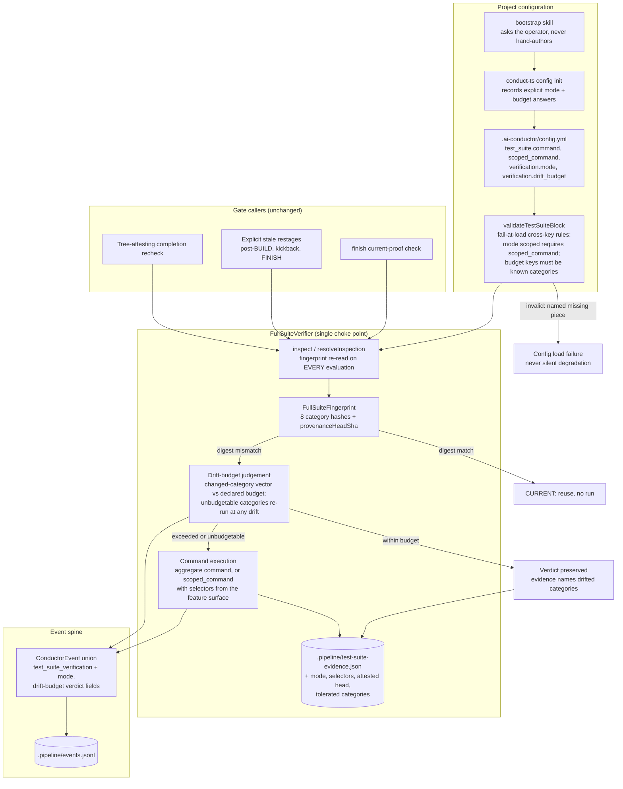

# Components: Budgeted, mode-aware test_suite verification

**Last updated:** 2026-08-28
**Scope:** Per-project drift budget and aggregate-vs-scoped verification mode for the `test_suite` gate (issue #2021): the `test_suite.verification` config block, the budget judgement inside `FullSuiteVerifier`, evidence/event visibility of the chosen mode, and bootstrap recording of the operator's answers.

## Diagram



## Responsibilities and boundaries

- **Inspection is never skipped.** The fingerprint is still re-read on every evaluation
  (tree-attesting membership per adr-2026-08-19 is preserved). The budget changes only the
  *consequence* of an observed mismatch: within a declared per-category budget the prior PASS is
  preserved with an auditable record; outside it the suite re-runs. `docs/explanation/gates.md`'s
  "the evidence file's existence can never satisfy it" stays true — preservation is a judged
  outcome of inspection, not a bypass of it.
- **The budget is keyed on the eight existing fingerprint categories** (`source`, `tests`,
  `test_infrastructure`, `dependencies`, `migrations`, `project_config`, `environment`,
  `additional_inputs`) — the operator-reasonable axis the issue asks for. `dependencies`,
  `migrations`, and `environment` are unbudgetable: any drift there re-runs regardless of config.
- **Unset config is byte-for-byte today's behavior**: mode defaults to aggregate, absent budget
  means zero tolerance — every category mismatch re-runs.
- **Scoped mode is a first-class verification mode**, not a fallback: `verification.mode: scoped`
  without a usable `scoped_command` is rejected at config load naming the missing key; an empty
  selector resolution refuses (never silently expands to aggregate, per
  adr-2026-08-01-engine-owned-scoped-test-invocation). Selectors derive from the feature surface
  (merge-base diff) supplied by the caller; the scoped command and selector set are hashed into
  the evidence identity.
- **Evidence records what the PASS covered**: mode, selectors (scoped), attested
  `provenanceHeadSha`, and any categories tolerated under budget since — so an operator can
  reconstruct the attested tree and its drift from `.pipeline/` alone.
- **Events ride the existing spine**: the verification outcome (mode, budget verdict, exhausted
  category) extends `test_suite_verification` / the existing `build_member_evidence_*` members —
  no new channel.
- **Bootstrap asks, machinery writes**: the bootstrap skill collects the two answers and records
  them through `conduct-ts config init` arguments; hand-authoring `.ai-conductor/config.yml`
  remains forbidden.

## Configuration shape

```yaml
test_suite:
  command: "npm test"
  scoped_command: "npm test -- {selectors}"
  verification:
    mode: aggregate          # aggregate (default) | scoped
    drift_budget:            # absent = zero tolerance (today's behavior)
      foreign_source: 5      # illustrative: tolerated drift per budgetable category
      docs_adjacent: unlimited
```

The exact budget vocabulary (which categories are budgetable, what units bound them) is settled
by `/architecture-review` and stories; the diagram fixes only the seams: config → load-time
validation → single judgement point inside the verifier → evidence + events.

## Legend

- Rounded nodes are engine operations; cylinder nodes are gitignored sidecars.
- `CONFIG` flows run at load/bootstrap time; `CORE` runs at every gate evaluation.
- Green-path outcomes (`CURRENT`, `TOLERATED`) run no suite command; only `RUN` spends wall clock.

## Change Log

| Date | Change | Reason |
|------|--------|--------|
| 2026-08-28 | Initial generation | DECIDE phase for issue #2021 |
