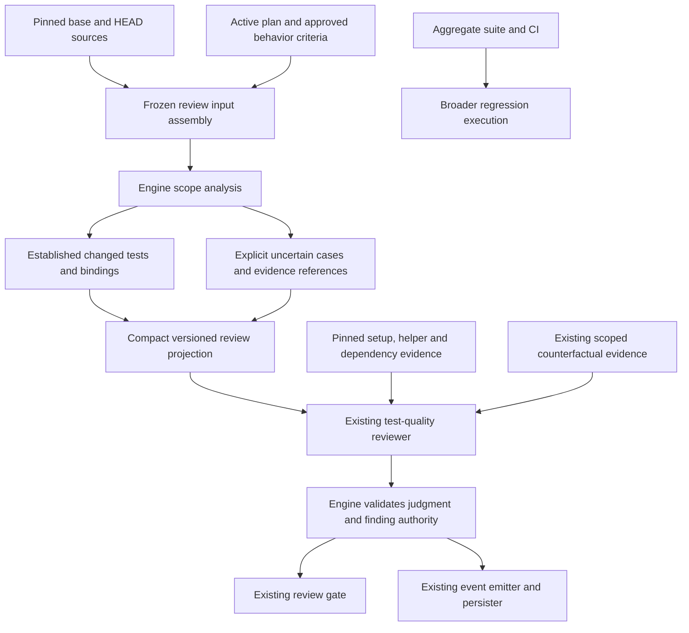

# Components: Accurate test-quality review scope

**Last updated:** 2026-09-06
**Scope:** Proposed component boundaries for #2231, component boundary approved by operator on 2026-09-06. Existing build-review flow is extended within the conductor process; no new deployment or data store.

## Diagram

## Responsibilities and limits

The engine owns reproducible source identities, mechanically established changes, marker association where it can be established, compact references, and explicit uncertainty. Planned tests help identify intended proof but cannot establish all indirect dependencies or confer a missing behavior binding.

The reviewer owns assertion quality and relevance judgments that static analysis cannot establish. Uncertain candidates are not mislabeled as verified changed tests. Broader referenced context remains available without listing every unchanged sibling as a changed target. Reviewer inference cannot invent an approved criterion or task.

The distinction between a genuinely empty opted-in scope and an unresolved scope must survive assembly, projection, judgment validation, and the outer result. Architecture review will resolve its precise gate semantics before stories are accepted. Existing opt-in ownership remains: this work does not authorize quality findings against every unmarked test.

The configured counterfactual runner and aggregate suite retain their execution contracts. Narrowing reviewer context does not itself narrow regression execution. No additional LLM session is assumed for routine scope selection; uncertain cases are presented through the existing reviewer boundary.

## Evidence and design status

Verified from `build-review-inputs.ts`: current scope association parses markers across each entire changed file; title extraction enumerates HEAD declarations without comparing individual bodies to base. Verified from `build-review-coordinator.ts`: titles are filtered by admitted file selector, and an empty admitted set currently returns PASS. Verified retained issue replay: 724 projected titles versus eight recognized added/modified bodies. This is evidence of excess scope, not proof that exactly eight tests are authorized or that helper impact is absent.

The proposed analysis is not yet implemented or benchmarked. Architecture review must choose supported parsing and fallback behavior, validate compatibility with generic consumer test frameworks, and define cache and anchor changes. Token and latency savings require measurement; no percentage is promised.

## Legend

Engine components run inside the conductor. The reviewer is the existing configured provider boundary. Evidence references name pinned source, not mutable live content. Aggregate execution has a separate responsibility from assertion-quality review.

## Change Log

| Date | Change | Reason |
|---|---|---|
| 2026-09-06 | Initial component proposal | Operator chose comprehensive engine-led scope with explicit uncertainty |

> **Amended 2026-09-06 by #2231:** architecture review and plan now resolve the earlier open gate semantics. Only concretely evidenced opted-in candidates enter fallback judgment; production-only refactors without candidates preserve empty-scope PASS and zero reviewer/preflight dispatch. The existing reviewer records scopeResolutions, which are source-validated before finding authority is constructed. Result identity remains v3; input projection advances to v3. Tasks 1/8 own frozen source/analysis integration, Task 10 projection, Task 12 provider settlement, Tasks 13–16 preflight/empty/recovery routing, and Task 17 cache reuse. The operator-approved component boundary is unchanged.
