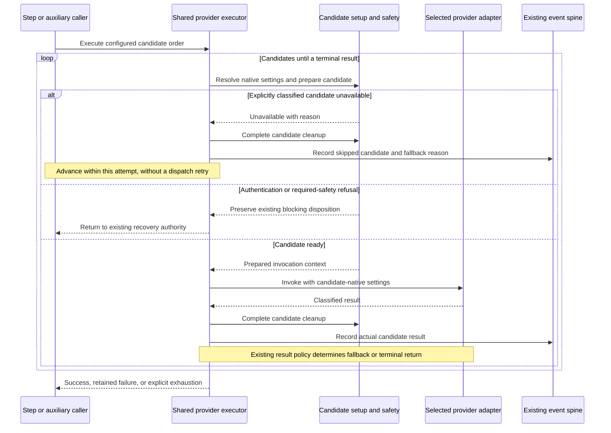

# Sequence: Provider setup failures preserve configured fallback

**Last updated:** 2026-09-11
**Scope:** Shared candidate execution for ordinary and self-host callers; approach A, pending operator diagram review.

> **Amended 2026-09-11 by #1285:** The operator approved this diagram and Medium complexity in the composer session. The flow is accepted for architecture review.

## Diagram

## Legend

The loop ends on success or any result whose existing policy forbids fallback. Only an explicit candidate-unavailability classification advances after setup failure; arbitrary thrown exceptions are not converted into availability. Required safety remains authoritative for every candidate. Cleanup failure prevents advancing when safe release cannot be established. Self-host preparation is one caller-specific setup path, not the scope of the shared contract.

Skip and result diagnostics use the existing `provider_attempt` and fallback-warning paths through `ConductorEventEmitter`; this feature adds no sidecar log or alternate event schema. Exact classification and cleanup ownership are resolved in architecture review after this diagram is accepted.

## Change Log

| Date | Change | Reason |
|------|--------|--------|
| 2026-09-11 | Initial scoped sequence | Show approach A and preserved recovery boundaries for issue #1285 |
