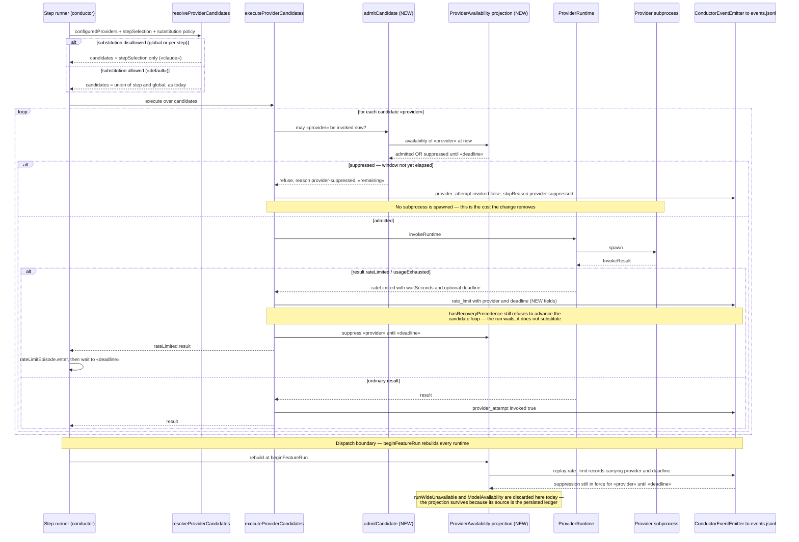
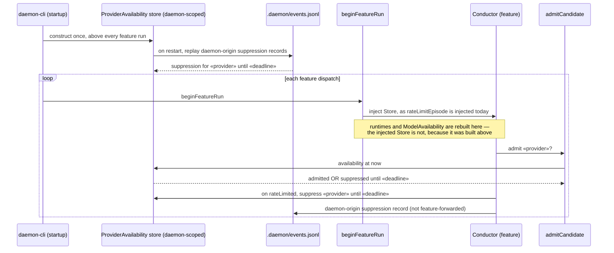

# Sequence: Provider admission — substitution policy and spine-durable exhaustion suppression

**Last updated:** 2026-09-23
**Scope:** How a step's provider candidate list is narrowed by substitution policy, how each
candidate passes a single admission gate before any subprocess is dispatched, how a usage-exhausted
provider is recorded on the event spine with its provider and deadline, and how that suppression is
rebuilt across the `beginFeatureRun` boundary that discards every runtime-object cache today.

## Diagram

## Amendment

> **Amended 2026-09-23 by #1492:** the diagram above shows the projection rebuilt at
> `beginFeatureRun` by replaying the feature's own `.pipeline/events.jsonl`. Architecture review
> falsified that: `startFeatureEventPersistence` writes `<worktree>/.pipeline/events.jsonl`
> (`event-persister.ts:306-308`), which no other feature can see, and
> `startDaemonEventPersistence` — the only daemon-wide ledger, `<mainRoot>/.daemon/events.jsonl`
> (`event-persister.ts:324`) — **drops every feature-forwarded event**
> (`if (isForwardedFromFeature(event)) return;`, `event-persister.ts:326-327`). A `rate_limit`
> emitted inside a feature's conductor is feature-forwarded, so it never reaches the daemon ledger
> and a replay-rebuilt projection would always come back empty.
>
> The corrected ownership is below: the availability store is **daemon-scoped and injected**,
> exactly as `RateLimitEpisode` already is — `createRateLimitEpisode()` is constructed once at
> `daemon-cli.ts:1113`, above every feature run, and injected into each Conductor
> (`daemon-cli.ts:1391`, `:1957`; held at `conductor.ts:2692`). Because it is constructed above
> `beginFeatureRun`, it survives the dispatch boundary without any replay. Durability across a
> daemon restart comes from daemon-origin emission of the suppression record, which is not
> feature-forwarded and therefore does persist to `.daemon/events.jsonl`.
>
> The original diagram is preserved above as the superseded mechanism.

### Corrected ownership

## Legend

- **`admitCandidate`** is the one new seam, evaluated per candidate immediately before dispatch.
  Both refusal classes flow through it: substitution policy and exhaustion suppression. Neither
  gets its own bypass path, so there is one place to read and one telemetry record to consult.
- **`provider_attempt { invoked: false }`** is reused, not invented. Its documented meaning is
  already "a cached unavailability avoided process dispatch"; the refusals extend `skipReason`
  alongside the existing `setup-unavailable` and `cached-unavailable` values.
- **The `rate_limit` event gains `provider` and `deadline`.** Today it carries `waitSeconds` and an
  optional `reason` only, so the persisted ledger cannot say which provider was exhausted or when it
  recovers — which is precisely why no cache can be rebuilt from it.
- **Suppression is self-expiring.** The bound is the deadline the adapter already parses (Claude
  emits `{ waitSeconds, deadline }`; Codex emits `waitSeconds` only), falling back to a bounded
  interval when no deadline was parsed. A transient limit therefore never permanently demotes a
  provider.
- **Exhaustion is still not a fallback trigger.** `hasRecoveryPrecedence` continues to short-circuit
  before any candidate advance, so the run's outcome is unchanged — it waits. The change removes the
  wasted subprocess that exists only to rediscover the same limit, once per step and again per
  feature dispatch.
- **The projection is spine-derived by design.** Per this repository's event-spine principle, the
  durable state extends the existing record rather than adding a sidecar file; that is also what
  makes it survive `beginFeatureRun`, where `runWideUnavailable` (a plain runtime field) and
  `ModelAvailability` (an explicitly in-process `Set`) are both thrown away.

## Change Log

| Date | Change | Reason |
|---|---|---|
| 2026-09-23 | Initial diagram for the admission gate, the policy narrowing, and spine-carried suppression. | Fix the seam, the new event fields, and the dispatch-boundary rebuild before implementation, and make explicit that exhaustion remains a wait rather than becoming a substitution (#1492). |
