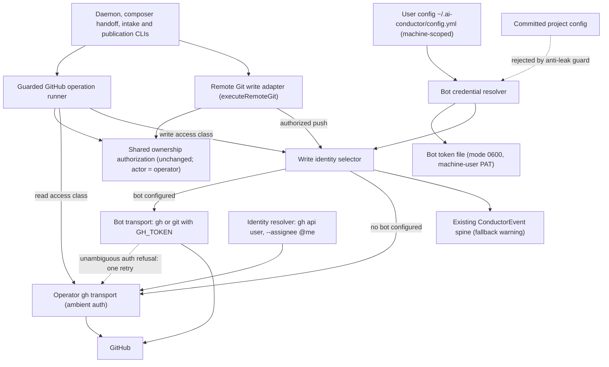
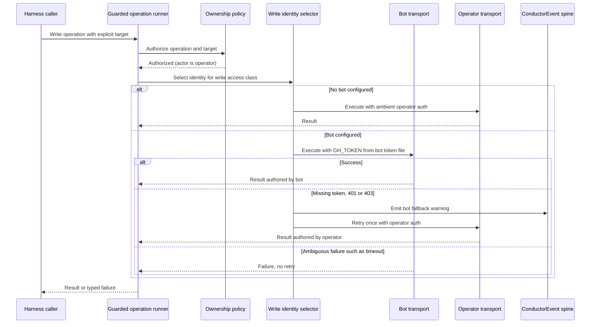
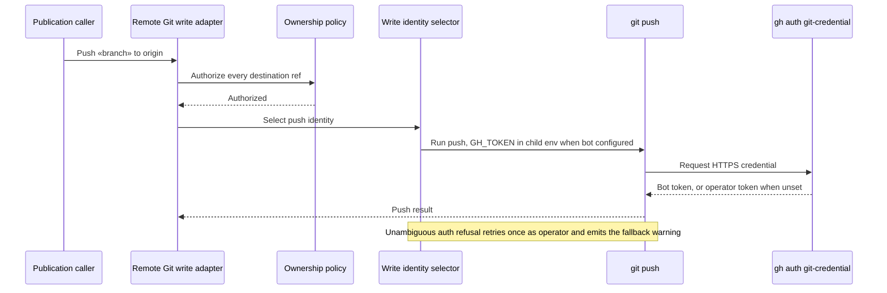

# Components and sequences: Optional bot identity for harness GitHub writes

**Last updated:** 2026-09-23
**Scope:** To-be write-identity selection inside the guarded GitHub boundary of
adr-2026-09-11-github-operation-ownership, for jstoup111/ai-conductor#158. Feature:
`use-a-dedicated-bot-identity-for-daemon-github-act`. Covers the guarded GitHub operation
runner, the remote Git write adapter, and the machine-scoped bot credential. Read paths,
including identity resolution and `@me` intake capture, are shown only to mark them unchanged.

## Component diagram

## Sequence: guarded GitHub write

## Sequence: remote Git push

## Legend

- **Write identity selector** — new. Chooses which credential performs an already-authorized
  write. It never changes authorization: the ownership policy's actor stays the machine-resolved
  operator (adr-2026-07-01-machine-scoped-operator-identity), so the bot acts on the operator's
  behalf and is not a second owner.
- **Bot credential resolver** — new. Reads an optional bot block from user config only; a bot
  key in committed project config is rejected by the existing anti-leak guard. It points at a
  token file rather than holding the token value.
- **Operator gh transport** — today's `makeProductionGh` process call with ambient auth. All
  reads use it, so `gh api user` identity and `--assignee @me` intake stay the operator's.
- **Bot transport** — the same single admitted `gh` process call (and the remote Git runner)
  with `GH_TOKEN` in the child environment. `gh` gives `GH_TOKEN` precedence over stored
  credentials for github.com, and the configured git credential helper is `gh auth
  git-credential`, so HTTPS pushes pick it up.
- **Dashed retry edge** — fires only for an unambiguous auth refusal, once, with a warning event
  on the existing spine. Ambiguous failures do not retry, to avoid duplicate comments or PRs.

## Change Log

| Date | Change | Reason |
|------|--------|--------|
| 2026-09-23 | Initial generation | DECIDE for #158: optional bot identity for harness writes |
| 2026-09-23 | Plan update | The write identity selector is realized as a `credential` hint on the `GhRunner` and `RemoteGitCommandRunner` options. The production transports act on it, and the fallback lives in `createGuardedGithubOperationRunner` and `executeRemoteGit`. The fallback event is `github_write_credential_fallback`. |
