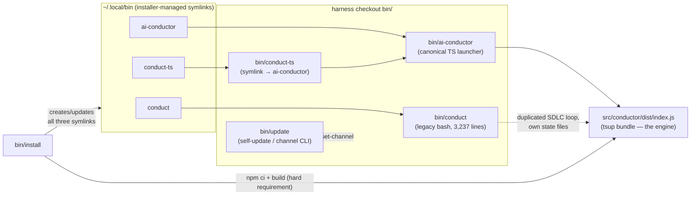
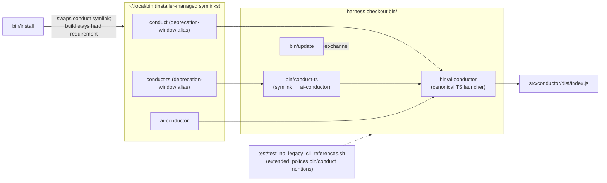

# Containers: v1.0 CLI cutover — entrypoint topology

**Last updated:** 2026-08-29
**Scope:** The operator-facing CLI entrypoints and installer symlink topology, before and after
removing the legacy bash `bin/conduct`.

## Diagram

### Before (two parallel CLIs)

### After (single CLI, alias window)

## Legend

- Solid arrows: symlink resolution or invocation path.
- Dashed arrows: relationships being removed (legacy duplication) or enforcement (guard test).
- `bin/conduct` and `test/test_conduct_worktree.sh` are deleted; `~/.local/bin/conduct` survives
  as an alias into the TS launcher, mirroring the `conduct-ts` deprecation window from PR #2023.
- Deliberately dropped flags (no TS equivalent, operator-approved): `--auto`, `--step`, `--log`,
  `--output`. `--update`/`--set-channel` live on in `bin/update` (#220).

## Change Log

| Date | Change | Reason |
|------|--------|--------|
| 2026-08-29 | Initial generation | DECIDE for issue #226 (v1.0 CLI cutover) |
