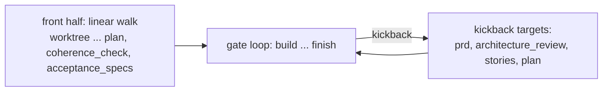

# SDLC phases

Why the flow has five phases, what each one is for, and what makes a phase boundary mean something. The
enumerated step table — names, order, enforcement, tier skips — lives in [steps](../reference/steps.md).

## The five phases

| Phase | Sequential steps | Purpose | Output class |
| --- | --- | --- | --- |
| SETUP | 1 | isolate the work before anything mutates | a worktree and a branch |
| UNDERSTAND | 1 | load what is already known | recalled memory, prior decisions |
| DECIDE | 9 | convert an idea into a committed, reviewable spec | artifacts under `.docs/` |
| BUILD | 5 | turn the plan into code that provably runs | commits plus run evidence |
| SHIP | 6 | prove the built thing matches what was specified, then land it | audits, a PR, a shipped record |

The counts are the sequential steps only. Four more steps exist out of band and hold no slot in the ordered
walk: `bootstrap` and `assess` run as a prelude before the loop, and `remediate` and `attribution_verify`
are dispatched on demand. They have full step definitions so that dispatching one cannot crash the loop with
an unknown-step error.

Five is not an aesthetic choice. Each phase is the span over which one *kind* of thing is true:

- Before SETUP, nothing is isolated — so SETUP comes first, before even memory recall, so that every
  subsequent commit lands on the feature branch.
- UNDERSTAND is read-only. Nothing it produces gates anything.
- DECIDE produces committed artifacts and nothing else. No implementation code exists yet, so a mistake here
  costs a rewrite of a markdown file rather than a rebuild.
- BUILD produces commits. From here on, changing the spec is expensive.
- SHIP produces judgements *about* the built code, comparing it back against the DECIDE artifacts.

## What makes a boundary meaningful

A phase name organizes the flow for humans. The boundary the engine actually enforces is a different one,
and it sits inside BUILD.

Up to `build`, the engine walks the step list forward, one step at a time, checking prerequisites. At
`build`, control hands to a gate-driven loop: each loop step's verdict is recomputed after it runs, and a
downstream gate can re-open an upstream one by writing an invalidation with evidence attached. Four steps
opt in as kickback targets — `prd`, `architecture_review`, `stories`, `plan` — which is to say the loop can
throw work back as far as the spec, but no further.

Both properties are derived from per-step flags rather than hardcoded, so a custom step inserted into the
tail joins the loop automatically by inheriting the flag from the step it follows. See
[configuration](../reference/configuration.md) for the insertion syntax and
[extending](../contributing/extending.md) for adding one.

Three practical consequences of the boundary:

- **A phase boundary is where evidence changes class.** DECIDE evidence is committed to `.docs/` and travels
  with the branch. BUILD and SHIP run evidence lives in `.pipeline/` and is gitignored on purpose —
  tracking it produced date-stamp sprawl, rebase conflicts, and dirty-tree halts at the finish-time rebase.
- **A prerequisite is a step name, not a phase.** Steps name the specific steps they depend on, so a skipped
  step still satisfies its dependents.
- **Going backward is a first-class move, not an error path.** Interactive navigation marks the target step
  `pending` and everything downstream `stale`, then re-runs forward.

## Complexity tiers

Every feature is classified S, M, or L during DECIDE, from counts of concrete signals — data models,
integrations, auth surfaces, state machines, stories. The classifier takes the majority tier across signals
and **breaks ties toward the higher tier**: when the evidence is ambiguous, the flow buys the more
expensive path rather than the cheaper one.

The tier is a cost dial with exactly one setting that does anything:

| Tier | Effect |
| --- | --- |
| S | skips 8 steps, and disengages the land-time coherence gate entirely |
| M | skips nothing |
| L | skips nothing |

M and L are identical in flow. The tier exists to let genuinely small work — a one-file fix, a copy change —
avoid paying for architecture diagrams, conflict analysis, and traceability mapping. It
never *adds* ceremony to large work; L features and M features run the same step list.

Which steps tier S skips, and why each is safe to drop, is enumerated in [steps](../reference/steps.md).
The shape of the reasoning: everything skipped at S is either an analysis of interactions between many
moving parts (there are few), or a review artifact whose input would be trivial.

Two guardrails keep tier-based skipping from becoming a bypass:

- A step skipped by tier is marked `skipped`, and `skipped` satisfies downstream prerequisites. The flow
  does not silently stall behind a step it deliberately declined to run.
- Tier is the only thing that skips those steps. You cannot reach the same result by config: the config
  validator rejects `disable: true` on gating and structural built-ins unless the step definition explicitly
  opted in, and structural steps can never be disabled at all. Exactly one built-in opts in today.

## Product track versus technical track

Each feature is also classified onto a track during `explore`: `product` or `technical`. The split is
deliberately narrow — it changes three things and nothing else.

| Difference | Product track | Technical track |
| --- | --- | --- |
| `prd` step | runs, authoring enumerated functional requirements | skipped |
| `prd_audit` step | runs, auditing the shipped code requirement by requirement | skipped |
| land-time coherence `fr` layer | required | not required |

Everything else is identical: explore, complexity, worktree, architecture, stories, conflict-check, plan,
coherence-check, the whole of BUILD, manual test, as-built review, rebase, finish.

The split is narrow because it answers one question — *does this work have enumerated product requirements
to trace against?* — and only the steps that consume those requirements can differ. A refactor has no
functional requirements, so a requirement-by-requirement audit of it would either be empty or invented.
Everything else (does the design hold, do the stories cover the negative paths, does the suite pass) is
equally true of both.

When the track is unknown the flow defaults to `product`, which is the more demanding of the two. Skipping
by track uses the same `skipped` mechanism as tier skipping, so downstream prerequisites stay satisfied.

## Checkpoints

Two steps in the default flow are checkpoints: `build` and `manual_test`. A checkpoint is a harness-level
pause with no agent session running — you review the output, then continue, navigate back, or quit.
Checkpoints are skipped entirely in auto mode, which is what makes an unattended daemon run unattended.

## Out-of-band steps

`bootstrap` and `assess` run in a prelude before the ordered loop, because they describe the project rather
than the feature. `assess` is additionally short-circuited on a brand-new project — nine specialist
reviewers have nothing to review in an empty repo. `remediate` is dispatched by the SHIP gates when they
need a gap-closing plan, and `attribution_verify` on demand. None of them occupies an ordered slot, which is
why they never appear in the step index.

## This repo is not the default

This repository runs the harness on itself and its own configuration deviates from the flow described above
— it disables one SHIP step and inserts a custom gating step into the tail. That configuration is described
in [self-hosting](../guides/self-hosting.md). Everything on this page is the default flow, which is what a
consumer project gets.

To see the flow run end to end once, follow [first feature](../guides/first-feature.md). For what blocks
progression at each boundary, see [gates](gates.md).
